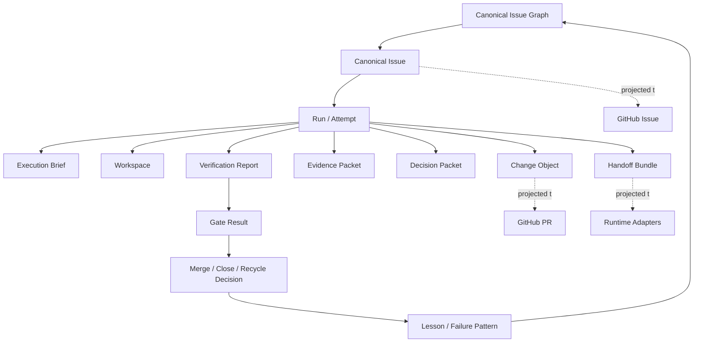
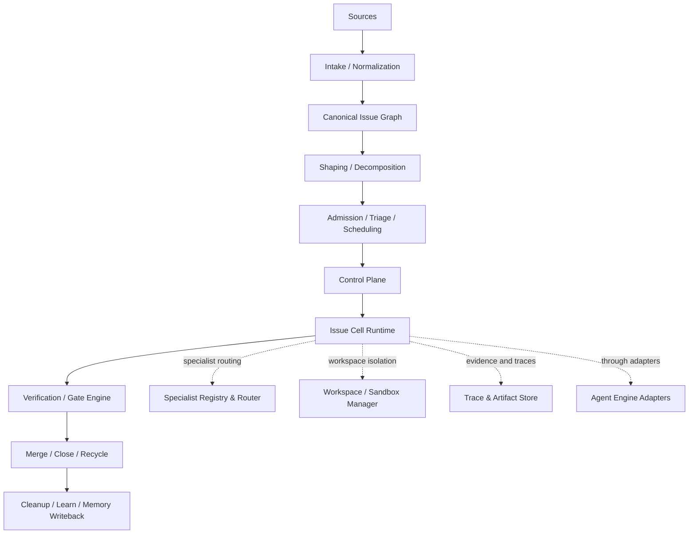
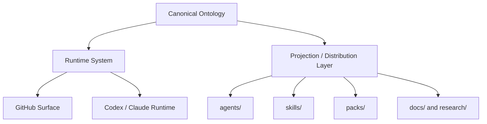

# Issue-Driven Agent Operating System

## 一份以 Issue 为核心、以控制面为治理中枢、以通才执行为默认路径、并可投影到仓库与平台表面的 AI Agent 系统蓝图

> 本文档是一份体系级架构蓝图。
> 它讨论的是“未来完整系统应当长成什么样”，而不是实施排期、V1 范围或某个 workflow 脚本的细节。
> 它回答的是系统的整体构成、核心概念、理论基础、角色与组件、运行机制、治理方式，以及它与 Codex / Claude Code / GitHub / 本仓库 package 体系之间的关系。

---

## 0. 文档定义与定位

### 0.1 这份文档是什么

这是一份面向未来的软件研发 Agent 系统蓝图。
它定义一套 `Issue-Driven Agent Operating System`，用于在尽量少人工介入的前提下，持续发现、整形、拆分、执行、验证、合并并收尾软件项目中的工作项。

这份蓝图融合了两个维度：

- 一套完整、平台中立的系统本体设计
- 一套与当前仓库 `agents / skills / packs / docs` 结构兼容的落点映射

它既不是脱离现实的抽象白皮书，也不是过早收缩到某个具体平台或脚本实现的施工说明。

### 0.2 这份文档不是什么

它不是：

- 单一 Agent 的提示词草案
- 一份只面向 GitHub Actions 或某一种 orchestrator 的实施说明
- 人类组织结构到 AI 组织结构的简单翻译
- 一份按优先级排实施计划的 roadmap
- 一个只强调“多 Agent 数量”的 swarm 宣言
- 一个围绕当前仓库现状做局部优化的窄文档

### 0.3 这套系统的本体是什么

这套系统的本体不是“一个更强的 coding agent”。
它本质上是一个任务操作系统：

- 以 `issue` 为统一任务对象
- 以控制面为治理中枢
- 以 per-issue runtime 为执行容器
- 以验证、证据、状态机和策略为稳定性来源
- 以 Codex / Claude Code 这类 coding agent 作为执行引擎
- 以 skills / subagents / context / scripts / policies 作为能力装配方式

### 0.4 这份蓝图的设计前提

这份蓝图建立在我们此前讨论确认的前提之上：

- 候选需求可以来自多来源，例如外部反馈、评审发现、 Bug 信号、规划事项等。
- 这些候选需求最终应统一落到 `issue` 中，`issue` 是主要任务对象和控制面载体。
- 系统不能只有“生产者-消费者”这一个抽象，还必须包含整形、拆分、调度、验证、收尾等关键环节。
- 顶层不采用纯 swarm 式完全自治结构，而采用更稳健的“控制面 + issue 内执行单元”结构。
- 单个 issue 的执行更适合“带回环的工作组”而不是严格单向流水线。
- 大 issue 需要可拆分，而且拆分既应发生在执行前，也应允许发生在执行中。
- 面向未来时，不应再按人类岗位直接设计大量常驻 Agent，而应更多地按“执行、判断、控制、拆分”和“工具域、判断域”来设计。
- 系统应尽量符合当前主流的 harness engineering 思路。

### 0.5 这套系统的评判标准

这套系统不是为了“看起来先进”，而是为了满足三个硬标准：

1. 系统要稳定。
2. 系统要尽量减少人工参与。
3. 架构必须面向未来，既适配现在，也适配模型和 Agent 能力进一步增强后的形态。

---

## 1. 背景、使命与最终目标

### 1.1 为什么要做这件事

传统软件研发流程中，需求管理、任务拆分、研发执行、测试验证、合并发布、收尾归档通常由多人协作完成。历史上之所以需要较强的人类岗位分工，很大程度上是因为：

- 单个执行者的上下文容量有限。
- 前端、后端、架构、测试、设计、产品等能力分布在不同人身上。
- 不同岗位掌握的工具、环境、标准和判断框架不同。
- 任务推进需要持续的人工协调、追踪、回收和修正。

但在当前模型与 coding agent 能力持续增强的背景下，情况已经发生变化：

- 通才型 coding agent 已具备较强的全栈执行能力。
- Agent 可以在较长上下文中保持任务记忆与执行连续性。
- 工具调用、浏览器自动化、代码搜索、测试执行、环境隔离能力越来越成熟。
- 多 Agent 协作、handoff、trace、guardrail、evaluation 等基础设施正在快速完善。

这意味着，系统设计的重心不再是简单地把人类组织结构一比一翻译成 Agent 组织结构，而是要重新定义：

- 什么是统一任务对象。
- 什么是系统的控制面与执行面。
- 什么是默认执行单元，什么是按需触发的专家单元。
- 何时需要拆分任务，何时需要升级或人工兜底。
- 如何让系统既稳定又能随着模型能力提升而自然演化。

### 1.2 系统使命

这套系统的使命是：

1. 把分散、模糊、异构的工作信号统一收敛成结构化任务对象。
2. 让任务能够被稳定地整形、拆分、调度和推进。
3. 让大多数研发工作由通才型 coding agent 自动完成。
4. 让特殊工具域和判断域由专家单元按需介入。
5. 让高风险动作由规则化 gate 和治理层控制，而不是靠自由语言拍板。
6. 让整个过程可追踪、可恢复、可交接、可学习、可演化。

### 1.3 最终效果

当系统成熟后，一个工作项应当能够经历如下生命周期：

```text
多来源信号
  -> Intake / Normalization
  -> Canonical Issue Graph
  -> Shaping / Decomposition
  -> Admission / Triage / Scheduling
  -> Issue Cell Runtime
  -> Verification / Gate
  -> Merge / Close / Recycle
  -> Cleanup / Learn / Memory Writeback
```

理想状态下，系统应能达到以下效果：

- 候选需求稳定进入统一任务模型
- 大任务在执行前或执行中都能合法拆分
- 多个任务能并行推进而互不污染
- 每个任务都有独立上下文、独立证据、独立 trace
- 关键状态推进都有结构化依据
- 长任务可以跨 run 延续，而不是依赖单次会话记忆
- 系统能把失败经验回流为后续能力

---

## 2. 核心设计思想与方法论

### 2.1 Issue-Driven：先把工作对象化，再谈自动化

系统中的一切自动化都建立在一个前提上：
**工作必须先被对象化，才能被稳定自动化。**

因此，这套系统选择 `issue` 作为统一任务对象。
无论任务来自用户反馈、 Bug 信号、规划项、 PR review 还是运行中衍生问题，它们进入系统后都应先被收敛为同一种任务语义。

### 2.2 Control Plane / Execution Plane Separation：控制与执行必须分离

系统明确区分：

- `控制面`：负责准入、调度、状态推进、资源限制、重试、合并门禁、关闭与回收
- `执行面`：负责研究、编码、修改、测试、回改、局部判断与证据生成

这种分离不是为了增加抽象层，而是为了获得三件事：

- 稳定性
- 可观测性
- 可恢复性

执行可以灵活，控制必须克制。

### 2.3 Generalist-First：默认一个强通才，按需调用专家

系统默认由一个强通才 coding agent 主导 issue 执行。
不应把“前端 Agent、后端 Agent、测试 Agent、产品 Agent”设为默认常驻组织形式。

只有在以下情况出现时，才调用专家单元：

- 需要特殊工具
- 需要特殊约束
- 需要特殊判断标准
- 需要特殊风险 gate

因此，专家是补充路径，而不是默认世界观。

### 2.4 Specialists Defined By Tooling And Judgment：专家按工具域与判断域定义

专家单元的差异主要来源于：

- 使用什么工具
- 读取什么上下文
- 输出什么结构化结论
- 在什么条件下触发
- 拥有什么写权限

因此，未来系统中“设计专家”“浏览器 QA 专家”“架构专家”等的本质，应是不同的 `tool profile + context pack + decision contract`，而不是更强的“人格”。

### 2.5 Decomposition as First-Class：拆分不是补丁，而是系统主干

大任务不是异常，而是常态。
所以拆分不能只靠人工，也不能只靠执行者临场发挥。系统必须把拆分能力提升为一等能力，并支持两种触发方式：

- `预执行拆分`：进入执行前先做整形与拆分
- `执行中拆分`：执行中暴露复杂度后再回流拆分

### 2.6 Contract-First：先定义对象和契约，再装配 Agent

系统不应从“先写几个 Agent 看能不能聊起来”开始。
正确顺序应当是：

1. 先定义任务对象和状态语言
2. 再定义运行时对象与角色契约
3. 再定义 skills、context packs、policies、scripts
4. 最后才把它们装配成具体实现

### 2.7 Evidence-First：证据比自述更重要

系统里不能依赖一句“我觉得已经修好了”。
任何状态推进都应尽量建立在结构化证据之上，例如：

- 测试结果
- 浏览器截图与日志
- review 结论
- 验收报告
- diff 摘要
- benchmark
- 风险分析

### 2.8 Explicit Memory：记忆必须写成工件，而不是赌会话连续

真正能长期运行的 Agent 系统，不应该把记忆只放在会话上下文里。
计划、约束、当前状态、失败原因、下一步、专家结论、handoff 信息，都应该写进系统工件中，成为可以读取、交接、复用、审计的显式对象。

### 2.9 Bounded Autonomy：自治必须有边界、有预算、有出口

这套系统允许任务局部自治推进，但每个自治循环都必须有：

- 终止条件
- 升级路径
- 预算边界
- 策略边界

没有边界的自治不是智能，而是漂移。

### 2.10 Platform-Neutral Ontology：内部本体先独立于平台

虽然系统可以映射到 GitHub Issues、PR、labels、projects、checks，但平台不应成为系统的本体。
系统本体应先定义自己的内部对象，再映射到具体平台。

### 2.11 Harness Engineering：靠环境、契约与验证稳定系统

本方案中的 harness engineering 指的是：通过环境、工具、contracts、workflows、verification、trace 和 policies 来约束与提升 agent 的稳定表现，而不是仅依赖 prompt 调优。

从方法论上说，这套系统并不把 agent 看成“拟人化员工”，而把 agent 看成：

- 在特定工具与上下文中运行的执行器
- 被控制面编排和约束的局部自主体
- 可以被 contracts、gates 和 traces 治理的系统单元

---

## 3. 核心概念与对象模型

这一部分定义系统真正操作的对象，而不只是 UI 层面的卡片或 PR。

### 3.1 Canonical Issue

`Canonical Issue` 是系统的统一任务对象。
它表达“要解决什么”，而不是“某个平台上的一条记录”。

一个 canonical issue 至少应包含：

- 唯一标识
- 来源类型
- 描述与背景
- 当前问题或目标
- 初始证据
- 风险等级
- 验收标准
- 依赖关系
- parent / child 关系
- 当前生命周期状态

### 3.2 Issue Graph

系统不操作孤立 issue，而是操作 `Issue Graph`。
图中的关系至少包括：

- parent / child
- blocks / blocked_by
- follow_up
- duplicate_of
- relates_to

Issue Graph 让系统能真正表达“整体任务”和“子任务”之间的关系，而不是把所有东西都扁平塞进 backlog。

### 3.3 Run / Attempt

同一个 issue 可能会经历多次执行尝试。
因此必须区分：

- `Issue`：长期业务对象
- `Run` 或 `Attempt`：某次具体执行尝试

这样系统才能表达：

- 重试
- 换策略重跑
- 超时回收再排期
- 人工介入后重新派发

### 3.4 Workspace

每个 run 都应拥有独立 `Workspace`。
Workspace 的作用不是存文件本身，而是提供：

- 上下文隔离
- 副作用隔离
- 并行执行隔离
- 失败后可回收性
- 证据与日志的归档空间

它可以映射为 worktree、分支、沙箱目录、容器或其他执行环境。

### 3.5 Change Object

系统中应把代码变更对象单独建模，而不让它隐含在 issue 里。
它至少包括：

- branch / worktree 标识
- diff 摘要
- 关联 PR
- 变更范围
- 相关验证状态

### 3.6 Execution Brief

`Execution Brief` 是 issue 进入执行前的标准简报。
它不是原始 issue 文本，而是适合执行者消费的版本，应包含：

- 当前任务边界
- 本轮目标
- 不做什么
- 依赖与风险
- 验收重点
- 当前策略或建议路径

### 3.7 Evidence Packet

`Evidence Packet` 是执行过程中的结构化证据集合。
它可以由执行者、专家或验证器产出。

典型内容包括：

- 命令结果摘要
- 测试输出摘要
- 截图、浏览器日志、网络日志
- 变更前后行为对比
- reproduction steps
- 风险点

### 3.8 Decision Packet

`Decision Packet` 是判断单元或治理单元产出的结构化决策对象。
它描述的不是“发生了什么”，而是“根据什么判断，建议系统怎么走下一步”。

典型字段包括：

- decision type
- rationale
- evidence references
- next action
- required gate
- escalation requirement

### 3.9 Verification Report

`Verification Report` 是系统对“完成度”与“可合并性”的正式结论对象。
它与普通 review 评论不同，应明确说明：

- 检查了什么
- 如何检查
- 是否满足 done contract
- 是否满足 gate
- 未解决风险

### 3.10 Handoff Bundle

`Handoff Bundle` 是跨 run 或跨角色交接的最小必要信息集合。
它至少应包含：

- 当前状态
- 已完成事项
- 未完成事项
- 当前阻塞
- 下一步建议
- 关键证据索引
- 当前预算消耗摘要

### 3.11 Skill

`Skill` 是可复用能力模块。
它关注的是某种稳定的工作模式、判断方法、工具用法、输出契约，而不是某个具体任务本身。

### 3.12 Context Pack

`Context Pack` 是某类任务或专家常用上下文的稳定封装。
它可以包含：

- 规则文档
- 设计系统说明
- 架构约束
- 历史缺陷模式
- 领域术语

### 3.13 Script

`Script` 是确定性、可重复执行的辅助操作。
它承担“不要让 LLM 重复发明轮子”的部分，例如：

- 运行验证命令
- 导出日志
- 生成报告骨架
- 收集证据
- 执行 cleanup

### 3.14 Policy

`Policy` 是系统的明确规则与边界定义。
它规定：

- 哪些动作允许自动推进
- 哪些状态必须经过 gate
- 哪些风险必须升级
- 哪些写权限属于控制面

### 3.15 Service

`Service` 是系统级运行组件。
它承担独立的运行责任边界，但不应被误写成 agent，也不只是某种可复用 skill。

典型例子包括：

- `Workspace / Sandbox Manager`
- `Specialist Registry / Router`
- `Trace & Artifact Store`
- `Merge / Close / Recycle Controller`
- `Projection / State Sync`
- `Budget Checker`

### 3.16 Pack

`Pack` 是一组能力装配单元。
它把 agents、skills、policy 约定、示例配置和文档一起装成可安装、可复用、可投影的系统集合。

### 3.17 Repo Package

`Repo Package` 是当前 monorepo 中的作者视角分发单元。
例如：

- `agents/<name>/`
- `skills/<name>/`
- `packs/<name>/`

它解决的是“如何组织、版本化、分发和投影能力”，而不是“系统运行时对象如何存在”。

### 3.18 Budget Envelope

`Budget Envelope` 是自治边界的一部分。
它描述某个 issue / run 在本轮执行中可使用的资源预算，例如：

- token 或模型预算
- 时间预算
- specialist 调用预算
- 回环次数预算
- sandbox / CI 资源预算

### 3.19 Trace

`Trace` 是系统对运行过程的可观测记录。
它至少要帮助回答：

- 这个任务经过了哪些步骤
- 谁做了哪些判断
- 哪些证据支撑了状态推进
- 失败发生在哪里

### 3.20 Lesson / Failure Pattern

`Lesson` 或 `Failure Pattern` 是系统学习的基本产物。
它可以沉淀为：

- 下次可复用的经验
- 失败模式归纳
- 新的 specialist trigger
- 新的 policy 调整
- 新的 skill 优化方向

### 3.21 对象关系图

下面这张图把主要系统对象放在同一条关系链里，方便理解“任务对象、运行对象、交付对象、验证对象、学习对象”之间的关系。



---

## 4. 系统整体架构

### 4.1 总体结构



### 4.2 架构分层

#### 第一层：治理层

治理层负责：

- task admission
- triage
- priority / risk 控制
- 状态推进
- gate 判定
- merge / close / recycle
- 预算与策略边界

这一层的关键词是“可治理”，不是“更聪明”。

#### 第二层：运行层

运行层负责：

- per-issue run
- issue cell loop
- specialist 调用
- evidence 生成
- verification 执行
- handoff 与 retry

这一层的关键词是“可执行”。

#### 第三层：能力层

能力层负责提供：

- skills
- context packs
- scripts
- policies
- experts

这一层是系统的能力装配层，而不是工作对象本身。

### 4.3 系统视图

从系统视角看，这套蓝图同时包含四种视图：

- `任务视图`
  系统如何接住、组织和推进 issue。
- `运行视图`
  系统如何拉起 run、隔离 workspace、记录 trace、形成 handoff。
- `能力视图`
  系统如何通过 skill、context pack、policy、specialist 组合完成任务。
- `平台视图`
  系统如何映射到 GitHub、Codex、Claude Code 以及本仓库的 package 结构。

### 4.4 备选架构空间

为了避免把当前方案误当成唯一自然答案，这里明确列出几种真实可行的总体架构选项。

#### 选项 A：单执行器线性流水线

结构：

- intake / shaping 后直接交给一个通才执行器
- 执行器完成编码、测试、回改、收口
- 控制面尽量薄

优点：

- 最简单
- 最快落地
- 协调成本最低

缺点：

- 难以表达复杂治理
- 拆分与回流能力弱
- specialist 接入会越来越别扭
- 难以支撑更长任务和更多并行

适用场景：

- 任务规模小
- 风险低
- 更看重尽快起步而不是长期系统性

#### 选项 B：控制面 + Issue Cell + 按需 Specialist

结构：

- 顶层由治理内核负责任务对象、状态、预算和终局动作
- 单个 issue 在局部 execution cell 中完成执行回环
- specialist 只在特定工具域和判断域按需介入

优点：

- 稳定性和自治性平衡最好
- 可治理、可扩展、可回流
- 能容纳大任务拆分与多类验证 gate
- 对未来模型增强有较高 option value

缺点：

- 架构复杂度高于单执行器模型
- 需要更强的 contracts、artifacts、state discipline

适用场景：

- 希望少人工但不能失控
- 任务异构且长期存在
- 需要逐步扩展 specialist 和治理能力

#### 选项 C：顶层自治 Swarm / 市场型架构

结构：

- 多个 agent 共享任务池或共享上下文
- 通过动态 handoff、自主抢单或模型选择下一位执行者来推进

优点：

- 自治性最高
- 角色扩展自然
- 对开放式探索任务有吸引力

缺点：

- 状态一致性难
- 可审计性弱
- 少人工场景下最容易漂移
- 终局动作和风险治理很难做硬约束

适用场景：

- 高探索性研究任务
- 对稳定交付和治理要求较低
- 把实验性自治放在首位

### 4.5 为什么本蓝图选择选项 B

本蓝图明确选择 `选项 B：控制面 + Issue Cell + 按需 Specialist`，原因如下：

- 相比选项 A，它能更自然地容纳拆分、回流、verification gate、显式 memory 和多类 specialist。
- 相比选项 C，它在少人工参与前提下更容易保持秩序、审计性和状态一致性。
- 它既允许当前阶段用更轻的物理实例实现，也允许未来在不推翻架构的前提下增强自治程度。

从 future-aware 的角度看：

- `Now`
  选项 B 对当前模型、当前平台能力和当前团队治理要求的适配度最高。
- `Next`
  随着模型变强，Issue Cell 内部可以逐渐合并更多角色，但控制面和对象模型仍然成立。
- `Option Value`
  该方案保留了向更轻模型和更强自治模型双向演进的空间，而不是过早把系统锁死在“单执行器”或“自由 swarm”之一。

---

## 5. 主要系统组件

### 5.1 Sources

Sources 是候选信号的来源层。
它们可以来自：

- 外部反馈
- bug 报告
- roadmap 规划
- PR review 发现
- runtime learn 回流
- 人工录入

Sources 的目标不是直接发起代码执行，而是把原始信号送入 Intake。

### 5.2 Intake & Normalization

Intake 的职责是把原始信号转成结构化任务草案。
它负责：

- 补齐基础字段
- 去除明显噪音
- 标注来源
- 提取初始证据
- 形成 issue draft

它不负责复杂拆分，也不负责正式进入执行。

### 5.3 Canonical Issue Graph

Canonical Issue Graph 是系统的任务知识骨架。
它负责：

- 持久化 canonical issue
- 维护 issue 之间的关系
- 表达 parent / child / dependency / duplicate
- 为后续 shaping、dispatch、learn 提供全局结构

没有 Issue Graph，系统就只能操作孤立 issue，而不能操作任务结构。

### 5.4 Shaping & Decomposition

这一层是系统的一等单元，不是附属流程。
它负责回答：

- 这个 issue 是否已经足够清晰
- 是否可直接执行
- 是否过大、过杂、边界不清
- 是否应拆成 parent / child issue
- 是否应先补 acceptance criteria
- 是否应先调用探索工具再正式拆分

它的输出通常包括：

- shaped issue
- decomposition proposal
- updated issue graph
- execution brief 草稿

### 5.5 Admission / Triage / Scheduling

这一层负责治理上的准入与排序：

- 是否进入 backlog
- 当前优先级和风险级别
- 是否可立即进入执行
- 是否需要等待依赖
- 是否需要预算审批

它回答的是“现在值不值得做、能不能做、排在哪”。

需要明确的是：
`Admission / Triage / Scheduling` 不是与 `Control Plane` 平级的另一套治理系统，而是 `Control Plane` 的入口子域。
它处理的是控制面最前端的准入、排序与排队问题；一旦 issue 被正式接住，后续状态推进、预算治理、gate 写入与终局动作都归入 Control Plane 主体。

### 5.6 Control Plane

Control Plane 是系统治理内核。
它负责：

- 认领与派发
- 状态推进
- 运行预算
- retry / recycle
- gate 写入
- merge / close / reopen
- 升级与人工兜底

这里最重要的原则是：

- LLM 可以辅助判断
- 但高风险状态推进应尽量由确定性脚本、规则和 policy 落盘

### 5.7 Issue Cell Runtime

Issue Cell Runtime 是围绕单个 issue 拉起的局部执行环境。
它负责：

- 加载 execution brief
- 维护本轮 issue context
- 运行 builder / critic / verifier loop
- 请求 specialist
- 生成 evidence、handoff、verification report

它不是整个系统的顶层组织方式，而是单个 issue 的作战室。

### 5.8 Specialist Registry & Router

这一层维护专家目录，并回答：

- 有哪些 specialist
- 各自的 trigger policy 是什么
- 各自能用什么工具
- 各自输出什么 contract
- 当前 issue 该调用哪一类 specialist

它不必是一个拟人化 agent，也可以主要由注册表和路由规则组成。

### 5.9 Verification & Gate Engine

这一层属于 `Service` 家族中的 runtime verification service。
它负责把“我觉得差不多了”转成结构化 gate。
它负责：

- 运行 done contract 检查
- 汇总验证证据
- 生成 verification report
- 判断是否通过 merge gate / close gate / recycle gate

### 5.10 Merge / Close / Recycle Controller

这一层负责终局动作的安全推进：

- merge
- close
- reopen
- recycle
- cleanup trigger

它不应依赖自然语言评论中的模糊暗示，而应依赖结构化状态和 gate 结果。

### 5.11 Cleanup / Learn / Memory

这一层负责系统收口与学习：

- 写回结果摘要
- 清理 workspace / branch / 临时工件
- 形成 failure pattern
- 形成 follow-up issue
- 更新 repo / project / issue / run memory

### 5.12 Workspace / Sandbox Manager

这一层负责执行隔离。
它至少要定义：

- 何时新开 workspace
- 何时复用 workspace
- 多 issue 并行时如何隔离
- worktree / branch / sandbox 的命名规则
- 资源和生命周期管理

### 5.13 Trace & Artifact Store

这一层负责沉淀执行过程中的结构化工件：

- evidence packet
- decision packet
- verification report
- handoff bundle
- logs
- screenshots
- test output

它是系统可追溯性的基础。

### 5.14 Agent Engine Adapters

这一层属于 `Service` 家族中的 runtime adapter service。
系统本体不应写死在某一个执行引擎上。
因此应有一层 adapter，把内部 contract 映射到具体引擎，例如：

- Codex
- Claude Code
- 未来的其他 coding agent runtime

Adapter 的作用是把内部世界翻译成外部运行时可执行的形式。

---

## 6. Issue Cell：核心执行单元

### 6.1 Issue Cell 的定义

Issue Cell 是围绕单个 issue 临时形成的执行单元。
它的目标不是“模拟一个完整人类团队”，而是：

- 为单个 issue 集中上下文
- 让执行与评估在局部回环中收敛
- 让专家只在必要时插入
- 为控制面提供结构化证据和状态建议

这一章的重点是 `logical role map`：
它说明单个 issue 的执行单元在逻辑上需要哪些责任视角。
至于这些角色默认如何物化、何时值得独立实例化、何时应降级为 skill / service / script，则由第 7 章统一定义。

### 6.2 Issue Cell 的逻辑角色

#### Case Owner

Case Owner 是 issue 的当前负责人。
它负责：

- 理解 shaped issue 与 execution brief
- 决定本轮执行策略
- 判断是否需要调用 specialist
- 汇总当前 run 的上下文

Case Owner 不一定总是一个独立的物理 agent；它经常可以与 Builder 合并。

#### Builder

Builder 负责：

- 读代码
- 改代码
- 补测试
- 处理 critic 反馈
- 形成新一轮 evidence

它是通才执行路径的主体。

#### Critic

Critic 负责：

- 审 diff
- 找缺漏
- 找与 issue / acceptance criteria 的偏差
- 标记 blocking / non-blocking 问题

Critic 不等于普通 reviewer，它是 Issue Cell 内部的质量对抗角色。

#### Verifier

Verifier 负责：

- 对照 done contract 验证结果
- 汇总测试与验证证据
- 判断是否满足 merge / close 的前置条件

Verifier 关注的是“这件事能不能安全进入下一状态”，而不是“代码风格是否优雅”。

#### Closer

Closer 负责：

- 触发 merge / close / recycle 的收口逻辑
- 写回结果摘要
- 触发 cleanup

Closer 更适合由规则和脚本主导，而不是高自由度推理。

#### Explore Utility

Explore Utility 是按需调用的探索能力：

- 代码库结构分析
- 影响面分析
- 未知依赖定位
- 失败点侦察

它通常不是常驻角色，而是辅助工具单元。

#### Planning Utility

Planning Utility 负责在 issue 内部做局部计划收敛，例如：

- 分解当前 run 的子步骤
- 形成短周期 plan
- 评估是否超出本轮预算

### 6.3 Issue Cell 主回环

Issue Cell 的主回环通常是：

```text
Execution Brief
  -> Case Owner
  -> Builder
  -> Critic
  -> Builder (revise)
  -> Critic (re-check)
  -> Verifier
  -> Closer
```

必要时，回环中会插入：

- specialist advisory
- specialist gate
- delegated subtask
- decomposition / escalation

### 6.4 回环终止条件

#### 成功终止

满足以下条件时可成功终止：

- done contract 满足
- required gates 通过
- verification report 明确通过
- close / merge 条件成立

#### 失败终止

满足以下条件时应失败终止：

- 预算耗尽
- 回环次数超限
- 风险超阈值
- 环境或依赖阻塞未解
- change quality 未收敛

#### 升级终止

满足以下条件时应升级终止：

- issue 边界明显失真
- 需要重新 shaping / decomposition
- 需要人工裁决
- 需要更高权限动作

### 6.5 逻辑角色与物理实例的区别

Issue Cell 中的角色首先是逻辑角色，不一定等于独立运行实例。

例如在更轻的实现中，可以收敛为：

- 一个主执行单元承担 Case Owner + Builder
- 一个独立评估单元承担 Critic
- 一个更规则化的验证与收口层承担 Verifier + Closer 的大部分动作

这让蓝图既完整，又不被“必须一角色一 agent”绑死。

---

## 7. 角色目录、Agent 边界与实例化规则

### 7.1 为什么这一章不能写成“未来 agent 清单”

这套系统必须同时区分三件事：

- `Logical Role`
  系统里的逻辑责任
- `Runtime Agent`
  值得独立实例化的运行单元
- `Repo Package`
  当前仓库里的作者视角分发单元

如果把这三者混成一层，就会出现两个常见误区：

- 一个 issue 里出现很多能力需求，于是被误解成应该有很多 agent 常驻并行
- 文档里的角色目录被误读成未来必须创建的一长串 package 清单

本蓝图明确反对这两种误读。

### 7.2 什么情况下才值得升级成独立 Agent

一个逻辑角色只有在至少满足以下一种条件时，才值得成为独立 runtime agent：

- 需要独立上下文隔离
- 需要不同的工具面或权限边界
- 需要独立预算或模型配置
- 需要并行运行以缩短关键路径
- 需要独立 decision contract 或 gate responsibility
- 需要被单独重试、恢复、审计或回收

如果不满足这些条件，就应优先考虑把它表达为：

- skill
- script / hook
- policy
- service
- artifact template

### 7.3 推荐的默认运行形态

本蓝图推荐的默认 issue runtime 形态不是“角色全开”，而是：

- `1` 个主执行单元
  - 通常承担 `Case Owner + Builder`
- `1` 条独立评估路径
  - 通常承担 `Critic / Evaluator`
- `0~2` 个按需 specialist
  - 只在工具域或判断域明显不同的时候进入
- 若干 control-plane services
  - 负责 state write、gate enforcement、budget enforcement、merge / close / recycle
- 若干 skills、scripts、policies、context packs、artifact templates
  - 作为能力装载层，而不是默认独立 agent

这条默认形态故意偏保守，因为它更符合当前最佳实践中的 `single-generalist-first` 和 `bounded multi-agent` 原则。

### 7.4 Role Manifestation Matrix

下表描述主要逻辑角色的默认物化方式。

| 逻辑角色                  | 默认物化形式                      | 默认是否实例化 | 何时升级为独立 Agent                        | 更常见的降级形式            |
| ------------------------- | --------------------------------- | -------------- | ------------------------------------------- | --------------------------- |
| `Case Owner`              | 主执行单元的一部分                | 是             | 需要与 `Builder` 分离持有不同上下文或权限时 | role only                   |
| `Builder`                 | 主执行单元的一部分                | 是             | 需要独立并行编码或独立模型预算时            | role only                   |
| `Critic`                  | 独立评估路径                      | 是             | 需要独立审计、隔离 review 上下文时          | review skill                |
| `Verifier`                | gate skill + verification service | 否             | 需要复杂、长期、独立验证上下文时            | verification skill / script |
| `Closer`                  | control-plane action / service    | 否             | 原则上不建议人格化                          | script / service            |
| `Explore Utility`         | 辅助 skill                        | 否             | 需要独立上下文做深探索时                    | skill / tool routine        |
| `Planning Utility`        | 辅助 skill                        | 否             | 复杂任务需要独立计划上下文时                | skill / artifact template   |
| `Diff / Impact Analyst`   | 分析 skill 或 service             | 否             | 需要独立并行影响面分析时                    | skill / report              |
| `Trace Summarizer`        | summarization skill 或 service    | 否             | 需要专门压缩超长运行历史时                  | skill / script              |
| `Learn Synthesizer`       | learn skill 或 service            | 否             | 需要独立学习管线时                          | skill / curated writeback   |
| `Browser QA Specialist`   | 按需 specialist agent             | 否             | 需要真实浏览器工具链和独立证据采集时        | browser QA skill            |
| `Architecture Specialist` | 按需 specialist agent             | 否             | 需要独立架构判断边界或 gate 责任时          | architecture review skill   |

### 7.5 建议保留为 agent family 的内容

在当前最佳实践下，最值得长期保留为 agent family 的通常只有三类：

- `Primary Execution Unit`
  - 默认主执行者，负责 issue 的主要代码推进
- `Evaluator / Critic`
  - 负责与主执行单元形成质量对抗或独立评估
- `Tool-Bound Specialists`
  - 例如 `Browser QA Specialist`、`Architecture Specialist`
  - 前提是它们真的具备独特工具面、权限面或 gate 责任

### 7.6 更适合降级为非-Agent的内容

以下内容更适合优先表达为 skill、script、service、policy 或 artifact，而不是新建人格化 agent：

- `Planning Utility`
- `Diff / Impact Analyst`
- `Trace Summarizer`
- `Handoff Bundle Writing`
- `Budget Check`
- `Learn Synthesizer`
- `Cleanup Trigger`
- 大多数 `Product / Acceptance` 边界强化动作

这不是在否定这些能力的重要性，而是在强调：
**一个 issue 需要很多能力，不等于需要很多 agent。**

---

## 8. Specialist 体系设计

### 8.1 为什么专家仍然长期有价值

即使通才 coding agent 越来越强，专家仍然长期有价值，因为：

- 工具差异会长期存在
- 约束差异会长期存在
- 判断标准差异会长期存在
- 风险门槛差异会长期存在

因此，专家不必围绕“模型智力差”存在，而是围绕“工具与判断域差”存在。

### 8.2 专家的统一定义模板

#### Tool Profile

它拥有哪些工具，能访问哪些执行环境，能产出哪些类型的工件。

#### Context Pack

它默认读取哪些领域上下文、规则文档、设计规范、风险清单。

#### Decision Contract

它输出什么结构化结论，包含哪些字段，如何被控制面或 Issue Cell 消费。

#### Trigger Policy

什么条件下调用它，什么条件下跳过，什么条件下必须经过它。

#### Permission Boundary

它可以写什么，不能写什么，能否直接修改代码，能否触发 gate，能否触发升级。

### 8.3 专家介入后的四种标准后继动作

#### Advisory

专家给出建议，主执行单元继续推进。

#### Gate

专家输出通过 / 不通过结论，主执行单元必须满足后才能继续。

#### Delegated Subtask

专家短暂接手一个局部子任务，产出结构化结果后回交主执行单元整合。

#### Escalation

专家判断当前问题超出本轮自治边界，回到控制面、shaping 层或人工治理层。

### 8.4 推荐的专家目录模板

建议长期维护一份专家目录，每个条目至少说明：

- name
- category
- tool profile
- default context pack
- triggers
- outputs
- permissions
- typical evidence
- gate semantics

---

## 9. Skill、Context Pack、Script、Policy、Artifact、Service、Pack 与 Repo Package 的判定规则

### 9.1 为什么必须把类型体系写硬

如果没有显式判定规则，系统会自然滑向两种坏结果：

- 本来只是方法或脚本的东西被人格化成 agent
- 本来只是 repo 里的分发单元，被误读成系统本体的一部分

因此，本章的目标不是再补更多名词，而是让每类对象都回答：

- 它解决什么问题
- 它的责任边界是什么
- 它为什么不是旁边那一类

### 9.2 Skill

`Skill` 用来承载稳定、可复用的 workflow、方法和输出契约。
它最适合表达：

- 一类可重复执行的工作模式
- 一组方法步骤
- 工具使用约定
- 标准输出结构

Skill 关注的是“如何做这类事”，而不是“谁来当这个人”。

### 9.3 Context Pack

`Context Pack` 用来承载稳定可加载的上下文集合。
它最适合表达：

- 领域规则
- 架构约束
- 设计系统
- 历史缺陷模式
- 风险清单

Context Pack 解决的是“做决定时默认带什么背景材料”。

### 9.4 Script / Hook

`Script / Hook` 用来承载确定性动作。
它最适合表达：

- 运行验证命令
- 收集日志与证据
- 生成标准骨架
- cleanup
- 标准化转换

当一件事更像“应稳定执行的固定动作”而不是“应由模型判断的开放动作”时，优先落到这里。

### 9.5 Policy

`Policy` 用来承载治理规则。
它最适合表达：

- 自动推进边界
- gate 规则
- 升级条件
- 风险阈值
- 预算规则
- 写权限边界

Policy 不是 agent 的人格特质，而是系统的正式约束。

### 9.6 Artifact

`Artifact` 用来承载系统运行中的正式产物。
它最适合表达：

- execution brief
- evidence packet
- decision packet
- verification report
- handoff bundle
- lesson / failure pattern

Artifact 是证据和状态的结构化落点，不应被混成 skill 或 agent。

### 9.7 Service

`Service` 用来承载系统级运行责任。
它最适合表达：

- workspace / sandbox 生命周期
- specialist registry / router
- trace / artifact storage
- projection / state sync
- merge / close / recycle control
- budget enforcement

Service 有自己的责任边界，但不等于 agent，也不等于 package。

### 9.8 Pack

`Pack` 负责装配与分发，不负责运行时治理。
它最适合表达：

- 某一套能力组合如何被安装、投影和复用
- 哪些 agents / skills / docs / examples 应被一起交付

`Pack` 是 distribution object，不是 runtime authority object。

### 9.9 Repo Package

`Repo Package` 是当前 monorepo 的作者视角组织单元。
它最适合表达：

- canonical source 如何被版本化
- installable units 如何被命名与发布
- docs 与 examples 如何和 package 对齐

Repo Package 解决的是“仓库里怎么放”，不是“运行时里怎么活”。

### 9.10 判定规则表

| 类型            | 主要判断问题               | 适合承载                                   | 不适合承载             |
| --------------- | -------------------------- | ------------------------------------------ | ---------------------- |
| `Role`          | 这是谁的逻辑责任？         | 责任分工、视角、职责命名                   | 运行时实例边界         |
| `Agent`         | 是否需要独立运行边界？     | 独立 context、独立工具、独立预算、独立审计 | 纯文档方法、固定脚本   |
| `Skill`         | 是否是可复用 workflow？    | 方法、步骤、输出 contract                  | 长期状态、系统治理裁决 |
| `Context Pack`  | 是否是稳定背景材料？       | 规则、设计、架构、历史模式                 | 临时聊天摘要           |
| `Script / Hook` | 是否应确定性执行？         | 检查、收集、cleanup、转换                  | 开放式判断             |
| `Policy`        | 是否是正式治理规则？       | gate、风险、升级、预算                     | 具体任务执行           |
| `Artifact`      | 是否是应沉淀的产物？       | brief、report、handoff、evidence           | 独立运行逻辑           |
| `Service`       | 是否是系统级运行责任？     | router、manager、store、controller、sync   | 泛化 persona           |
| `Pack`          | 是否是装配与分发对象？     | capability bundle、projection bundle       | 运行时状态裁决         |
| `Repo Package`  | 是否是仓库组织与发布单元？ | `agents/`、`skills/`、`packs/`             | 系统 ontology 本体     |

### 9.11 常见落位示例

以下落位可作为默认判断：

- `browser QA regression`
  - 默认是 skill；需要真实浏览器工具链和独立证据采集时，升级为 specialist agent
- `budget check`
  - 默认是 policy + service，不应人格化
- `handoff bundle writing`
  - 默认是 artifact template + skill
- `trace summarization`
  - 默认是 skill 或 service，不必天然做成 agent
- `cleanup and closeout`
  - 默认是 script + control-plane service

### 9.12 五层映射原则

这套系统里的常见映射应理解为：

- `Agent`
  负责承担少数真正需要独立边界的运行单元
- `Skill`
  负责提供复用 workflow
- `Tool`
  负责提供执行与观测手段
- `Artifact`
  负责沉淀状态、证据和交接信息
- `Service`
  负责持有系统级运行责任

一个稳定系统不是把所有东西都塞进 agent，而是让这些层级各司其职。

---

## 10. 状态模型、权限模型与 Gate 机制

### 10.1 为什么要拆成三套状态平面

如果把所有状态都压进一个 issue status，系统会很快失真。
更合理的方式是拆成三套状态平面：

- `Issue Lifecycle`
- `Run Lifecycle`
- `Change / PR Lifecycle`

这样系统才既能表达长期任务状态，也能表达某次执行尝试和具体代码变更。

这里必须再强调一次：

- `Issue Lifecycle`
  表达任务对象的业务阶段
- `Run Lifecycle`
  表达某次执行尝试的运行状态
- `Change / PR Lifecycle`
  表达具体代码交付对象的评审与合并状态

三者可以互相关联，但不应混用。

### 10.2 Issue Lifecycle

Issue 生命周期表达“任务对象现在处于什么阶段”。
可参考：

- candidate
- normalized
- shaped
- decomposed
- admitted
- ready
- active
- resolved
- closed
- recycled

这里要刻意避免把 run-level 语义塞进 issue 状态。
例如：

- `running`
- `awaiting_gate`
- `blocked_on_tool`
- `needs_specialist`

这些都应属于 `Run Lifecycle`，而不是 `Issue Lifecycle`。

在这个语境下：

- `ready`
  表示 issue 已具备执行条件
- `active`
  表示 issue 当前仍处于执行义务打开的阶段

它们表达的是任务业务阶段，而不是某个具体 run 正在做什么。

### 10.3 Run Lifecycle

Run 生命周期表达“本次具体执行尝试正在发生什么”。
可参考：

- created
- brief_ready
- environment_ready
- running
- blocked
- needs_specialist
- awaiting_gate
- succeeded
- failed
- escalated
- cancelled

### 10.4 Change / PR Lifecycle

Change 生命周期表达“这次代码变更在评审和交付上的状态”。
可参考：

- no_change_yet
- branch_opened
- patch_ready
- pr_opened
- review_requested
- changes_requested
- verified
- merge_ready
- merged
- abandoned

### 10.5 权限模型与决策权矩阵

为了避免“大家都能写一点，最后没人真正负责”的模糊状态，本系统把关键决策按权责拆开。

| 决策或动作                    | Issue Cell | Specialist | Control Plane | Human    |
| ----------------------------- | ---------- | ---------- | ------------- | -------- |
| 生成事实证据                  | primary    | primary    | observe       | optional |
| 提出拆分建议                  | primary    | optional   | consume       | optional |
| 触发 specialist 调用          | primary    | n/a        | govern policy | optional |
| 创建 / 回收 run               | propose    | no         | primary       | override |
| 推进 issue 生命周期状态       | suggest    | suggest    | primary       | override |
| 推进 run 生命周期状态         | suggest    | suggest    | primary       | override |
| 推进 change / PR 生命周期状态 | suggest    | suggest    | primary       | override |
| merge / close / recycle       | no         | no         | primary       | override |
| 覆盖预算约束                  | no         | no         | primary       | override |
| 修改 system policy            | no         | no         | no            | primary  |

这张矩阵表达的是：

- Issue Cell 负责产出事实、局部判断和推进建议
- Specialist 负责补充特定工具域和判断域的结构化结论
- Control Plane 负责正式写入状态、预算和终局动作
- Human 负责高风险 override 和规则维护

#### 执行与专家单元拥有

- 事实生产权
- 建议权
- 证据写入权
- 结构化报告写入权

#### 控制面拥有

- 状态推进权
- merge / close / recycle 裁决权
- 预算裁决权
- 高风险动作的最终写入权

#### 人工治理拥有

- override 权
- policy 维护权
- 高风险争议的终裁权

### 10.6 Budget Governance

`Budget Envelope` 不只是一个概念字段，它必须进入系统治理主线。

预算至少应覆盖：

- token / model budget
- 时间预算
- 回环次数预算
- specialist 调用预算
- sandbox / CI / 浏览器资源预算

预算应在以下节点被显式检查：

- admission 前
- run 创建前
- 每轮 critic 回环后
- specialist 调用前
- merge / close gate 前
- escalation 决策前

一旦超出预算，系统不应隐式继续，而应走以下路径之一：

- 降级执行
- 重新 shaping / decomposition
- recycle
- escalation

### 10.7 Done Contract

`Done Contract` 用于回答“什么叫真的做完了”。
它不应只是抽象文字，而应尽量结构化，至少包含：

- required outcomes
- required checks
- required evidence
- known accepted risks
- merge preconditions
- close preconditions

### 10.8 Gate 类型

系统中常见 gate 应包括：

- review gate
- acceptance gate
- browser QA gate
- architecture gate
- security gate
- performance gate
- merge gate
- close gate

并非每个 issue 都需要全部 gate，但每个 issue 应明确自己需要哪些 gate。

---

## 11. 运行机制：系统如何工作

### 11.1 从信号到 issue

系统先从 Sources 中接收原始信号，经由 Intake 标准化为 issue 草案，再写入 Canonical Issue Graph。

### 11.2 从 issue 到 execution brief

进入 Shaping / Decomposition 后，系统判断：

- 是否可直接执行
- 是否需补验收标准
- 是否需拆分

之后输出 `Execution Brief` 和初始 `Done Contract`。

### 11.3 从 brief 到 run

Control Plane 根据：

- 优先级
- 风险
- 依赖
- 预算

决定是否创建 run，并通过 Workspace / Sandbox Manager 准备执行环境。

### 11.4 Issue Cell 执行

Issue Cell 读取 execution brief 后：

- Case Owner 决定本轮推进策略
- Builder 执行实现
- Critic 进行内部回环评审
- 必要时调用 specialist
- 持续产出 evidence packet、decision packet、handoff bundle

### 11.5 进入 Gate

当执行达到“可判断完成度”的阶段后，系统进入 Verification & Gate Engine：

- 检查 done contract
- 检查 required gates
- 生成 verification report

### 11.6 收口

若满足条件，Merge / Close / Recycle Controller 推动收口：

- merge
- close
- cleanup
- memory writeback
- learn synthesis

### 11.7 执行中的拆分回流

如果执行中发现：

- 边界失真
- 复杂度严重超预期
- 出现多个独立子问题

Issue Cell 不应硬扛到底，而应回流到 Shaping / Decomposition，形成新的 child issue 或 follow-up issue。

---

## 12. 记忆、交接与 Learn 闭环

### 12.1 为什么记忆系统是主干，不是附属品

长任务系统如果没有显式记忆，就只能依赖当前会话上下文。
这会导致：

- run 之间断裂
- 失败原因丢失
- handoff 质量不稳定
- learn 无法形成闭环

因此，记忆系统是主干，不是锦上添花。

### 12.2 四层记忆

#### Repo Memory

仓库级长期知识，例如：

- 架构约束
- 设计系统
- 常见失败模式
- 项目级质量标准

#### Project Memory

项目运行层面的共享知识，例如：

- 当前 roadmap 主题
- 重点风险区
- 当前开放中的 issue cluster
- 当前启用的专家与 policy

#### Issue Memory

单 issue 相关长期信息，例如：

- issue 历史
- shaping 结论
- acceptance criteria
- decomposition 结果
- 关键 decision packets

#### Run Memory

单次运行相关短周期信息，例如：

- 当前 run 目标
- 已做事项
- 当前 blockers
- 当前预算
- handoff bundle

### 12.3 权威对象、派生对象与真相源层次

显式 memory 不等于“所有文档都是同等真相来源”。
本系统需要明确哪些对象是权威对象，哪些只是派生解释或交接工件。

建议遵循如下层次：

- `Canonical Issue / Issue Graph`
  是任务身份、任务边界、任务关系与高层任务状态的权威来源
- `Run Record`
  是某次执行尝试状态、预算消耗和 run-level blockers 的权威来源
- `Change Object`
  是代码交付对象、PR 对应关系与 change 生命周期的权威来源
- `Verification Report`
  是 gate 结论与 done contract 检查结果的权威来源
- `Repo Canonical Source`
  是仓库中 package、docs 和 projection 规则的作者视角权威来源
- `Handoff Bundle`
  是交接工件，不应反过来覆盖 issue、run 或 verification 的正式状态
- `Repo / Project Memory`
  是长期知识和治理上下文，不应直接替代 issue / run / change 的正式记录
- `GitHub Surface`、`.agents/`、`.codex/`、`.claude/`
  是平台或运行时投影表面，应反映 canonical state，而不是重新定义它

这条边界非常重要，因为它决定了：

- 状态冲突时以谁为准
- learn 写回时哪些对象可被更新
- 未来做 adapter 时哪些字段必须精确映射

### 12.4 冲突解决顺序与写入原则

当不同对象之间出现不一致时，系统不应依赖“谁最后说了一句话”，而应按对象域解决冲突。

建议采用以下规则：

- 任务身份、任务边界、任务关系、任务级状态的冲突：
  以 `Canonical Issue / Issue Graph` 为准；GitHub issue 标签或普通评论只能由 Control Plane 协调回写，不能直接反向改写 canonical graph。
- 某次执行尝试状态、预算消耗、run blockers 的冲突：
  以 `Run Record` 为准；issue 状态只能通过 Control Plane 根据 run 结果和 verification 结果来同步。
- 代码交付对象与 PR 元数据的冲突：
  以 `Change Object` 和平台原生 PR 元数据的结构化字段为准；评论线程本身不是 change state 的权威来源。
- gate 结果和“口头说通过”的冲突：
  以 `Verification Report` 为准；自然语言评论只能提供补充上下文。
- handoff bundle、trace、evidence 与正式状态的冲突：
  这些对象默认是 append-only 的解释与交接工件，不应直接覆盖 issue、run、change、verification 的正式记录。
- package canonical source 与 runtime projection 副本的冲突：
  以仓库中的 canonical source 为准；`.agents/`、`.codex/`、`.claude/` 只应被重新投影或重新生成，而不应作为反向编辑源。

如果必须给出更简化的冲突处理顺序，可遵循：

1. 先按对象域判断冲突属于 `issue / run / change / verification / package source` 中哪一类
2. 在该对象域中，以对应权威对象为准
3. projection surface 只能提出修正线索，不能直接成为新真相源
4. 正式修正由 Control Plane 或 canonical source 维护路径完成落盘

写入边界建议如下：

- `Issue / Issue Graph / Run / Change / Verification`
  由 Control Plane 主导正式写入
- `Evidence / Decision / Handoff`
  允许 Issue Cell 与 specialist 写入
- `Repo / Project Memory`
  以 append 和 curated writeback 为主，不应被执行单元随意重写

### 12.5 Learn 的产物

#### Failure Pattern

把失败归纳成可识别、可复用的模式。

#### Reusable Playbook / Skill Improvement

把成功或失败经验回写成可复用的 skill、policy 或 playbook 改进。

#### Follow-up Issue

把本轮未完成但值得继续追踪的问题写回 issue graph，而不是让信息停留在会话里。

---

## 13. 人工治理与升级点

### 13.1 低人工，不等于无人治理

这套系统追求的是“尽量少人工”，不是“彻底无人类”。
治理仍然需要存在，只是应尽量出现在高价值决策点上。

### 13.2 建议保留的人工介入点

建议长期保留以下人工升级点：

- 高风险 issue 的 admission
- 高影响架构变更
- 复杂拆分争议
- 多轮回环不收敛
- merge / close 前的高风险人工审阅

### 13.3 人工在系统中的角色

人工更像：

- 风险兜底者
- 规则维护者
- escalation 裁决者
- memory / policy 的最终维护者

而不是默认的一线搬运执行者。

---

## 14. 这套系统与 Codex、Claude Code、GitHub 的关系

### 14.1 与 Codex / Claude Code 的关系

Codex / Claude Code 更像这套系统的执行引擎，而不是这套系统本身。

它们提供的是：

- 代码理解与修改能力
- 工具调用能力
- worktree / sandbox / long-running task 基础能力
- skill / subagent / instruction 装配能力

本蓝图是在这些能力之上再加一层任务治理与运行时系统。

### 14.2 与 GitHub 的关系

GitHub 更像这套系统的主要外部控制面承载平台之一。
它可以承载：

- issues
- labels
- projects
- PR
- reviews
- checks

但 GitHub 不应成为系统本体。
系统应先有自己的对象模型，再把它映射到 GitHub。

### 14.3 为什么这套蓝图高度契合“基于 Codex / Claude Code 的稳健 Agent 系统”

因为它同时利用了这些执行引擎的长处：

- 通才 coding agent 作为默认主执行者
- specialist 通过工具域与 context pack 按需介入
- worktree / sandbox 隔离运行
- 显式 trace、evidence、handoff 支持长任务

同时又避免了常见失稳点：

- 把所有东西都交给自然语言协商
- 把状态机散落在 prompt 里
- 把岗位人格化当成系统设计

### 14.4 平台中立与平台映射的关系

系统内部应坚持平台中立对象：

- canonical issue
- run
- workspace
- change object
- evidence packet
- decision packet
- verification report
- handoff bundle

然后再映射到：

- GitHub issue / PR / labels / checks
- Codex 的 AGENTS / skills / runtime
- Claude Code 的 CLAUDE / subagents / hooks

这样架构不会因为某个平台能力变化而整体失效。

### 14.5 控制面部署拓扑选项

这里需要和第 4 章做一个明确区分：

- 第 4 章中的 `选项 A / B / C`
  讨论的是系统的逻辑总体架构
- 本节中的 `GitHub-Native / External Orchestrator / Hybrid`
  讨论的是控制面和运行时对象的部署承载方式

两者是正交维度，而不是互斥维度。
也就是说，一个系统完全可以同时是：

- `逻辑架构 = 选项 B`
- `部署拓扑 = Hybrid`

这套蓝图允许至少三种控制面拓扑：

#### GitHub-Native

- GitHub issues / PR / checks / projects 承担大部分控制面载体
- 外部只补少量 automation

优点：

- 最贴近现有协作面
- 用户心智成本低

缺点：

- 运行时对象表达力有限
- run / budget / trace / memory 容易被平台能力约束

#### External Orchestrator

- 外部常驻控制面进程或服务持有主要运行对象
- GitHub 主要作为外部协作与审计界面

优点：

- 运行时表达力强
- 更适合复杂 budget、trace、workspace、retry 管理

缺点：

- 平台整合复杂度更高
- 团队可见性和可理解性要求更高

#### Hybrid

- GitHub 负责 issue / PR / review 等协作对象
- 外部控制面负责 run、workspace、budget、trace、learn 等运行时对象

这是本蓝图当前最推荐的拓扑，因为：

- 它保留 GitHub 作为可见控制面
- 又不把系统本体锁死在 GitHub 的对象表达力之内
- 它最符合“平台中立本体 + 平台映射”的总体原则

---

## 15. 宿主、运行时与投影政策

### 15.1 Host-Not-Cage 原则

当前仓库可以成为这套系统的：

- host
- capability library
- projection surface

但它不应成为这套系统 ontology 的上位约束。

更直白地说：

- 仓库可以承载这套系统
- 仓库不该反过来定义这套系统

只要现有结构能低扭曲地承载概念，我们就利用它；一旦它开始扭曲概念，系统本体优先于兼容性。

### 15.2 Canonical Ontology / Runtime System / Projection Layer

这套系统更适合被理解成三层：

- `Canonical Ontology`
  - 负责定义 issue、run、change、verification、service、policy、artifact 等系统本体
- `Runtime System`
  - 负责 control plane、issue cell runtime、workspace、trace、budget、gate、router 等运行机制
- `Projection / Distribution Layer`
  - 负责把系统能力映射到 GitHub、Codex、Claude Code，以及当前仓库的 package 结构

下面这张图描述三层关系：



这张图要表达的是：

- ontology 先于 projection
- runtime 不必被当前 monorepo 完整吞下
- 当前仓库更像 distribution surface，而不是整个运行时本体

### 15.3 Compatibility / Projection Policy

与当前仓库结构兼容，不应成为自动默认项；它应该是有条件成立的 projection policy。

以下情况下，兼容是加分项：

- 当前目录语义能干净表达概念
- projection 成本低
- 有利于安装、分发、发现与维护
- 不会把 runtime object 假装成 package object

以下情况下，应主动打破兼容：

- 顶层目录开始误导 ontology
- 同一能力被迫拆散到多个 package 才能表达
- policy、context、artifact、service 长期沦为二等公民
- projection 逻辑开始比系统本体更复杂
- 为了贴合目录而不断改坏概念边界

### 15.4 当前仓库适合承载什么

当前 monorepo 非常适合承载以下内容：

- `agents/`
  - 只承载那些真正值得被包装成 agent family 的角色级 package
- `skills/`
  - 承载可复用 workflow、判断框架、工具使用约定、输出 contract
- `packs/`
  - 承载 capability bundles 和 projection bundles
- `docs/architecture/`
  - 承载系统蓝图、对象模型、治理原则和平台关系
- `docs/plans/`
  - 承载后续更细的优化计划和实施计划
- `docs/examples/`
  - 承载 issue forms、artifact 示例、specialist contract 示例和平台映射示例
- `research/`
  - 承载外部研究与实践对齐材料
- `scripts/`
  - 承载投影、构建、安装、同步和确定性辅助逻辑

### 15.5 当前仓库不应被强行承载什么

当前 monorepo 不应被默认理解为以下对象的唯一宿主：

- canonical issue graph runtime
- run store
- workspace / sandbox lifecycle manager
- trace / artifact operational store
- external control-plane services

这些对象未来完全可能存在于：

- 外部 orchestrator
- 独立 runtime service
- GitHub + external service 的 hybrid 部署中

因此，当前仓库更像“作者视角与分发视角的中心”，而不是“整个系统运行时的唯一体内器官”。

### 15.6 当前仓库中的具体投影方式

在当前仓库中，建议这样投影：

- `Agent`
  - 只在确实需要角色级安装与投影时，落到 `agents/<name>/`
- `Skill`
  - 优先落到 `skills/<name>/`
- `Pack`
  - 落到 `packs/<name>/`
- `Context Pack`
  - 通过 skill 文档、`references/`、`assets/`、`docs/examples/` 和 pack 组合承载
- `Policy`
  - 通过 architecture docs、skill docs、agent platform docs、examples 和 projection metadata 承载
- `Script`
  - 优先落到 skill package 的 `scripts/`、agent 支撑脚本或仓库级 `scripts/`
- `Service`
  - 在蓝图中作为 runtime 类型存在；只有在确实需要 repo-level 作者化时，才寻找对应 projection 形式

因此，蓝图里的类型体系不需要和当前仓库的顶层 package 类型一一镜像。

### 15.7 与当前现有资产的关系

当前仓库已经存在一些通用角色与能力，例如：

- `explorer`
- `planner`
- `reviewer`
- `docs-researcher`
- `implementer`
- `debugger`
- `researcher`

这些资产的正确位置是：

- 作为现有 capability inventory
- 作为命名和风格参考
- 作为过渡期的可利用投影

它们不应反过来决定蓝图本体应该长成什么样。

### 15.8 Canonical Source 与 Projection Copies

本仓库的 canonical source 在：

- `agents/<name>/`
- `skills/<name>/`
- `packs/<name>/`

运行时和平台投影会出现在：

- `.agents/`
- `.codex/`
- `.claude/`
- GitHub surface

因此需要坚持以下原则：

- canonical source 负责定义与维护
- projection copy 负责适配与运行
- projection copy 不应成为反向编辑源
- 当 projection 和 canonical source 冲突时，以 canonical source 为准

---

## 16. 这套蓝图是否符合目标概念

总体判断是：符合，而且是高度符合。

原因在于它真正设计的是一套“项目级 Agent 运行系统”，而不是一个“更会写代码的单一 Agent”。
它能够同时覆盖：

- 任务对象化
- 治理与执行分层
- 默认通才执行
- 按需专家介入
- 拆分与回流
- 验证与 gate
- 显式记忆与 learn 闭环
- 平台中立与仓库映射

### 16.1 真正需要警惕的问题

真正需要警惕的不是“agent 不够多”，而是：

- 过度人格化
- 过度去中心化
- 没有显式 memory 与 handoff
- 没有 done contract
- 把 merge / close 交给自然语言拍板
- 用当前仓库现状反向绑死未来系统本体

### 16.2 需要复审这套架构的触发条件

以下情况出现时，应主动复审这套蓝图，而不是默认继续叠补丁：

- 模型能力已经稳定到可明显收缩 Issue Cell 角色分工
- GitHub、Codex、Claude Code 或其他执行引擎获得新的原生运行时对象能力
- 系统从单仓库演进到多仓库 / 多团队 / 多租户
- specialist 数量和治理成本开始超过其带来的收益
- issue 不再适合作为统一任务对象
- 预算治理、状态平面或记忆层出现持续性冲突

---

## 17. 成功标志

当以下条件成立时，可以认为这套系统的架构方向是正确的：

- 候选需求可以稳定地落到统一 issue 模型中
- 大 issue 可以在执行前或执行中被系统化拆分
- 通才执行单元能完成大多数日常 coding 任务
- specialist 只在必要时介入，并且输出可被控制面直接消费
- issue、run、change 三套状态平面能稳定协同
- review、verification、merge、cleanup 有明确 gate
- 系统在少人工参与下能持续运行而不明显漂移
- 随着模型能力增强，系统可以减少 specialist 介入频率，而不需要推翻整体结构
- 系统能投影到本仓库的 `agents / skills / packs / docs` 结构，同时保留 runtime 独立演进的空间

### 17.1 文档验收清单

当以下条件同时成立时，可以认为这份蓝图文档已经达到本轮优化目标：

- 每个核心组件都能被明确归类为 role、agent、skill、script、policy、artifact、context pack、service 或 repo package 之一
- 默认 issue runtime 读起来是最小 execution cell，而不是多 agent 常驻清单
- `Role` 与 `Agent` 的边界在正文和矩阵中都足够清楚
- `Service` 已成为一等类型，但没有沦为杂项桶
- `Issue / Run / Change` 三套状态平面的命名边界干净
- source-of-truth 与 conflict resolution 已经写成正式规则
- 当前仓库被表述为 host / projection layer，而不是 system body
- 文档包含至少两张核心图：对象关系图、host/runtime/projection 图
- 文档既能指导未来 package 设计，又不会被 package 结构反向塑形

---

## 18. 名词速查

### Issue-Driven

先把工作收敛成统一任务对象，再谈自动化。

### Control Plane

负责状态、调度、gate、merge / close / recycle、预算和治理。

### Execution Plane

负责研究、编码、测试、回改、证据生成和 issue 内回环。

### Issue Cell

围绕单个 issue 拉起的局部执行单元。

### Specialist

在特定工具域和判断域内介入的专家单元。

### Skill

可复用能力模块。

### Context Pack

稳定可加载的上下文集合。

### Service

承担系统级运行责任的组件，例如 router、manager、store、controller。

### Policy

系统的规则、边界与约束定义。

### Pack

能力的装配与分发对象，而不是运行时治理对象。

### Repo Package

当前 monorepo 中的作者视角组织与发布单元。

### Gate

状态推进前的结构化前置条件。

### Run

某个 issue 的一次具体执行尝试。

### Handoff Bundle

跨 run 或跨角色交接的最小必要信息集合。

---

## 19. 最终结论

这套系统的最终结论可以压缩为以下几点：

- 统一使用 `issue` 作为任务对象和主要控制面载体
- 采用“控制面 + per-issue execution cell”的稳健运营型总架构
- 将 `Shaping / Decomposition` 设为独立一等单元
- 默认由通才 coding agent 主导 issue 执行
- 专家单元按“工具域 + 判断域”定义，并按需介入
- 专家介入后的动作严格限制为 `advisory / gate / delegated subtask / escalation`
- 将事实写权限与控制写权限分离
- 将当前 monorepo 视为 host 与 projection layer，而不是系统本体的唯一宿主
- 用显式 contracts、memory、gate、trace 和 policies 构建系统，而不是只堆 prompt
- 保持平台中立本体，同时明确映射到 GitHub、Codex、Claude Code 和当前仓库的 package 结构

因此，这不是一个“多造几个 AI 岗位”的方案。
它是一套真正面向项目级持续运行、可治理、可扩展、可落地到当前仓库结构中的 Agent 操作系统蓝图。
