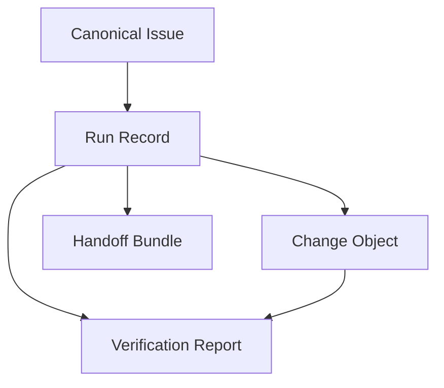

# Issue-Driven Agent OS Canonical Schema

**Date:** 2026-03-29  
**Primary blueprint:** `/Users/liqiongyu/projects/pri/my-agents/docs/architecture/issue-driven-agent-operating-system.md`  
**Implementation baseline:** `/Users/liqiongyu/projects/pri/my-agents/docs/plans/2026-03-29-issue-driven-agent-os-implementation-baseline.md`

## 0. Purpose

This document defines the first bridge-layer canonical schemas for the Issue-Driven Agent OS.

It exists to do one thing:

- make the system's core runtime objects explicit enough that follow-up runtime contracts, evaluation artifacts, and reference implementations stop guessing

This is a **canonical schema document**, not a final JSON Schema set and not an API protocol specification.

It defines:

- the minimum object boundaries
- required vs optional fields
- identity rules
- source-of-truth expectations
- cross-object relationships

It does **not** define:

- final transport formats
- final storage engines
- final API endpoints
- platform-specific projections into GitHub, Codex, or Claude Code

## 1. Scope

This document covers the five bridge objects frozen by the current implementation baseline:

1. `Canonical Issue`
2. `Run Record`
3. `Change Object`
4. `Verification Report`
5. `Handoff Bundle`

These are the minimum schema surfaces required to move from architecture blueprint to implementation preparation.

## 2. Schema Design Principles

### 2.1 Canonical Before Projection

Schema fields are defined for the system's internal ontology first.
Mappings to GitHub issues, PRs, labels, checks, `.agents/`, `.codex/`, or `.claude/` come later.

### 2.2 Stable Object Identity

Each object must have:

- a stable identity
- an owning domain
- a current state
- timestamps

Without those four things, recovery, reconciliation, and conflict resolution become fragile.

### 2.3 Object-Domain Ownership

Each object owns a different slice of truth:

- `Canonical Issue`
  - task identity, task boundary, task state, task relationships
- `Run Record`
  - attempt lifecycle, budget, blockers, runtime execution facts
- `Change Object`
  - code-delivery lifecycle and branch / PR association
- `Verification Report`
  - gate and done-contract results
- `Handoff Bundle`
  - cross-run or cross-role transfer context

No object should be overloaded to carry the full system state.

### 2.4 Explicit Required Fields

If a field is needed for:

- routing
- recovery
- gating
- audit
- state reconciliation

it should be explicitly required in the canonical object, not left implicit in free text.

### 2.5 Projection-Friendly, Not Projection-Shaped

The schema should be easy to project onto external systems, but projection constraints must not distort canonical object design.

## 3. Shared Field Conventions

The following conventions apply across all canonical objects.

### 3.1 Identity Fields

- `id`
  - canonical object ID inside the Agent OS domain
- `version`
  - schema version or object contract version

### 3.2 Time Fields

- `created_at`
- `updated_at`

Use ISO 8601 timestamps.

### 3.3 Provenance Fields

- `source`
  - where the object or update came from
- `written_by`
  - which control-plane path, agent, service, or human actor wrote it

### 3.4 Status Fields

Each object should own only its own status domain.
Do not copy foreign lifecycle state into the wrong object as a second source of truth.

### 3.5 Evidence References

When an object needs to point at logs, screenshots, reports, checks, comments, or documents, prefer structured references over raw pasted content.

## 4. Canonical Issue Schema

### 4.1 Role

`Canonical Issue` is the authoritative task object.

It owns:

- task identity
- task boundary
- task type
- task relationships
- issue-level lifecycle state

### 4.2 Required Fields

| Field                 | Purpose                                                                 |
| --------------------- | ----------------------------------------------------------------------- |
| `id`                  | Stable canonical issue ID                                               |
| `title`               | Human-readable task label                                               |
| `summary`             | Short problem statement                                                 |
| `type`                | Feature, bug, research, tech-debt, chore, or equivalent canonical class |
| `source_type`         | Origin of the task signal                                               |
| `state`               | Issue lifecycle state only                                              |
| `priority`            | Canonical priority level                                                |
| `risk_level`          | Canonical risk level                                                    |
| `acceptance_criteria` | Minimum success conditions for the task                                 |
| `relationships`       | Parent / child / dependency / duplicate links                           |
| `created_at`          | Creation time                                                           |
| `updated_at`          | Last update time                                                        |

### 4.3 Recommended Optional Fields

- `description`
- `non_goals`
- `evidence_refs`
- `labels`
- `owner_hint`
- `specialist_hints`
- `budget_hint`
- `projection_refs`

### 4.4 Example Shape

```yaml
id: issue_01JXYZ...
title: Fix checkout coupon validation drift
summary: Coupon validation differs between API and checkout UI.
type: bug
source_type: review
state: shaped
priority: p1
risk_level: medium
acceptance_criteria:
  - API and checkout UI reject expired coupons consistently
  - Existing valid coupons still apply successfully
relationships:
  parent: null
  children: []
  dependencies: []
  duplicates: []
created_at: 2026-03-29T10:00:00Z
updated_at: 2026-03-29T11:00:00Z
```

### 4.5 Notes

- `state` here must stay in the `Issue Lifecycle` plane.
- `Canonical Issue` should not absorb run-level details such as current sandbox state or loop count.

## 5. Run Record Schema

### 5.1 Role

`Run Record` is the authoritative object for one execution attempt of one issue.

It owns:

- run lifecycle state
- budget consumption
- blockers
- execution-scoped facts
- references to produced artifacts

### 5.2 Required Fields

| Field                 | Purpose                                                             |
| --------------------- | ------------------------------------------------------------------- |
| `id`                  | Stable run ID                                                       |
| `issue_id`            | Owning canonical issue                                              |
| `state`               | Run lifecycle state                                                 |
| `execution_brief_ref` | Reference to the brief used for this run                            |
| `budget`              | Budget envelope snapshot for this run                               |
| `started_at`          | Run start time                                                      |
| `updated_at`          | Last update time                                                    |
| `artifacts`           | References to evidence, decision, verification, and handoff outputs |

### 5.3 Recommended Optional Fields

- `workspace_ref`
- `current_blockers`
- `specialist_calls`
- `retry_of`
- `termination_reason`
- `last_checkpoint`
- `projection_refs`

### 5.4 Example Shape

```yaml
id: run_01JXYZ...
issue_id: issue_01JXYZ...
state: running
execution_brief_ref: brief_01JXYZ...
budget:
  tokens_max: 120000
  specialist_calls_max: 2
  review_loops_max: 3
  elapsed_minutes_max: 90
started_at: 2026-03-29T11:15:00Z
updated_at: 2026-03-29T11:48:00Z
artifacts:
  evidence: [evidence_01, evidence_02]
  decisions: [decision_01]
  verification: null
  handoff: null
```

### 5.5 Notes

- `Run Record` should not redefine issue priority, issue identity, or issue acceptance criteria.
- Run-level blockers belong here, not in the canonical issue body.

## 6. Change Object Schema

### 6.1 Role

`Change Object` is the authoritative delivery object for code change state.

It owns:

- branch association
- patch / PR association
- change lifecycle state
- link to the issue and run that produced it

### 6.2 Required Fields

| Field        | Purpose                              |
| ------------ | ------------------------------------ |
| `id`         | Stable change ID                     |
| `issue_id`   | Owning issue                         |
| `run_id`     | Producing run                        |
| `state`      | Change / PR lifecycle state          |
| `branch_ref` | Branch or worktree branch identifier |
| `created_at` | Creation time                        |
| `updated_at` | Last update time                     |

### 6.3 Recommended Optional Fields

- `pr_ref`
- `patch_ref`
- `review_refs`
- `ci_refs`
- `merge_commit_ref`
- `abandon_reason`

### 6.4 Example Shape

```yaml
id: change_01JXYZ...
issue_id: issue_01JXYZ...
run_id: run_01JXYZ...
state: review_requested
branch_ref: fix/coupon-validation-drift
pr_ref: github:pull/482
created_at: 2026-03-29T12:10:00Z
updated_at: 2026-03-29T12:40:00Z
```

### 6.5 Notes

- Review comments themselves are not the authoritative change state.
- Platform-native PR metadata may enrich this object, but the lifecycle still belongs to the canonical `Change Object`.

## 7. Verification Report Schema

### 7.1 Role

`Verification Report` is the authoritative object for gate outcomes and done-contract evaluation.

It owns:

- what was checked
- what passed
- what failed
- whether required gates were satisfied
- whether the issue is safe to advance

### 7.2 Required Fields

| Field               | Purpose                                             |
| ------------------- | --------------------------------------------------- |
| `id`                | Stable verification ID                              |
| `issue_id`          | Owning issue                                        |
| `run_id`            | Producing run                                       |
| `change_id`         | Related change object, if any                       |
| `done_contract_ref` | Which contract was evaluated                        |
| `gate_results`      | Structured results by gate                          |
| `overall_result`    | Pass, fail, blocked, or equivalent canonical result |
| `evidence_refs`     | Supporting evidence references                      |
| `created_at`        | Creation time                                       |

### 7.3 Recommended Optional Fields

- `risk_notes`
- `accepted_exceptions`
- `required_followups`
- `written_by`

### 7.4 Example Shape

```yaml
id: verify_01JXYZ...
issue_id: issue_01JXYZ...
run_id: run_01JXYZ...
change_id: change_01JXYZ...
done_contract_ref: done_01JXYZ...
gate_results:
  review_gate: pass
  acceptance_gate: pass
  browser_qa_gate: not_required
  merge_gate: pass
overall_result: pass
evidence_refs:
  - evidence_03
  - test_report_01
created_at: 2026-03-29T13:05:00Z
```

### 7.5 Notes

- A free-text comment saying “looks good” is not a substitute for a verification report.
- `Verification Report` should remain authoritative for gate outcomes even when projected to GitHub checks or comments.

## 8. Handoff Bundle Schema

### 8.1 Role

`Handoff Bundle` is the structured transfer object between runs, roles, or recovery points.

It owns:

- current state summary
- what was completed
- what remains
- blockers
- next-step guidance
- artifact references needed to resume safely

### 8.2 Required Fields

| Field           | Purpose                                    |
| --------------- | ------------------------------------------ |
| `id`            | Stable handoff ID                          |
| `issue_id`      | Owning issue                               |
| `run_id`        | Run that produced the handoff              |
| `current_state` | Short structured state snapshot            |
| `completed`     | Completed items                            |
| `remaining`     | Remaining items                            |
| `blockers`      | Known blockers                             |
| `next_step`     | Recommended next move                      |
| `artifact_refs` | Required evidence / decision / change refs |
| `created_at`    | Creation time                              |

### 8.3 Recommended Optional Fields

- `budget_snapshot`
- `resume_notes`
- `warnings`
- `specialist_pending`

### 8.4 Example Shape

```yaml
id: handoff_01JXYZ...
issue_id: issue_01JXYZ...
run_id: run_01JXYZ...
current_state: waiting_for_browser_validation
completed:
  - unified backend and UI coupon expiry logic
  - added regression tests for API layer
remaining:
  - confirm browser checkout flow against updated API behavior
blockers: []
next_step: trigger browser QA specialist and then re-run merge gate
artifact_refs:
  - change_01JXYZ...
  - evidence_03
  - decision_01
created_at: 2026-03-29T12:58:00Z
```

### 8.5 Notes

- `Handoff Bundle` is transfer context, not a source of truth for lifecycle state.
- It should help recovery and resume, not replace canonical records.

## 9. Object Relationships

The minimum bridge relationship graph is:



Interpretation:

- one issue can have many runs
- one run may produce zero or one primary change object
- one run may produce zero or one verification report
- one run may produce zero or one handoff bundle

Future schemas may expand this, but bridge-layer work should assume at least this much structure.

## 10. Source-Of-Truth Mapping

This document aligns with the master blueprint's ownership model:

- `Canonical Issue`
  - authoritative for issue identity, boundary, relationships, and issue lifecycle
- `Run Record`
  - authoritative for run lifecycle, budget, blockers, and run-scoped artifacts
- `Change Object`
  - authoritative for change / PR lifecycle and delivery references
- `Verification Report`
  - authoritative for done-contract and gate outcomes
- `Handoff Bundle`
  - authoritative only as handoff context, not as canonical lifecycle state

## 11. Projection Guidance

These canonical objects may later project to:

- GitHub issues, labels, comments, and PRs
- check runs or CI surfaces
- Codex runtime artifacts
- Claude Code subagent or hook-facing artifacts

But the projection layer should adapt **from** these canonical objects.
It should not become the place where the canonical meaning is first invented.

## 12. Open Boundaries Reserved For Runtime Contract

This document intentionally leaves the following open:

- exact API messages between control plane and issue cell
- whether artifacts live in files, stores, or service records
- exact ID formats
- exact enum values for every type and lifecycle
- projection-specific field transforms

Those belong in the runtime contract and implementation layers.

## 13. Acceptance Criteria

This bridge document is complete only if:

1. the five required bridge objects have clear boundaries
2. each object has required identity, state, and relationship fields
3. object ownership does not overlap in a way that creates a second source of truth
4. downstream runtime contract work can assume these object boundaries without reopening ontology debates
5. the document remains canonical and bridge-level, not an overgrown transport spec

## 14. Recommended Next Step

Use this schema document as the input to the next bridge artifact:

- `runtime contract`

The runtime contract should assume these object boundaries and define how `Control Plane`, `Issue Cell`, `Specialist`, `Service`, and `Adapter` exchange or update them.
