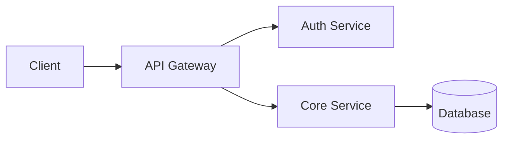

# README Craftsman

Create, update, or review README files by analyzing the actual repository and tailoring output to the project type and audience. Works for any GitHub repository — software projects, documentation sites, datasets, research repos, tutorials, community collections, and more. The goal is to produce READMEs that are accurate, scannable, and genuinely useful — not generic filler.

## Workflow

```
Detect Mode → Analyze Project → Classify Type → [Interview if Creating] → Generate/Update/Review → Quality Check → Deliver
```

---

## Step 1: Detect Task Mode

| Mode | When | Approach |
|------|------|----------|
| **Create** | No README exists, or user asks to "create / write / generate a README" | Full generation from codebase analysis |
| **Update** | README exists and code has changed, or user says "update / refresh / sync the README" | Targeted section updates, preserving existing voice |
| **Review** | User says "review / check / audit the README" | Compare README against actual project state, report findings |

If the mode is ambiguous, ask.

## Step 2: Deep Project Analysis

Before writing a single line, understand the project. This is what separates a useful README from a template dump.

### Metadata Discovery

Read whichever of these exist to extract name, version, description, dependencies, scripts, and entry points:

**Software projects:**
- **JS/TS**: `package.json`, `tsconfig.json`
- **Python**: `pyproject.toml`, `setup.py`, `setup.cfg`, `requirements.txt`
- **Rust**: `Cargo.toml`
- **Go**: `go.mod`
- **Ruby**: `Gemfile`, `*.gemspec`
- **Java/Kotlin**: `pom.xml`, `build.gradle`, `build.gradle.kts`
- **PHP**: `composer.json`
- **.NET**: `*.csproj`, `*.sln`

**Non-code projects:**
- **Doc sites**: `mkdocs.yml`, `docusaurus.config.js`, `.vitepress/`, `book.toml`, `_config.yml` (Jekyll)
- **Datasets**: `datapackage.json`, `dataset_info.json`, large `.csv`/`.parquet`/`.jsonl` files, `data/` dir
- **Academic**: `paper.tex`, `paper.pdf`, `notebooks/`, `experiments/`, `figures/`
- **Tutorials**: Numbered directories (`01-intro/`, `02-basics/`), `exercises/`, `solutions/`
- **Blogs**: `_posts/`, `content/posts/`, `hugo.toml`, `gatsby-config.js`, `astro.config.mjs`
- **Community**: `awesome-*.md`, curated link lists, `.github/` org repo patterns

**Universal checks:**
- `LICENSE` / `LICENSE.md` — detect license type
- `.github/workflows/` — CI/CD pipelines, release workflows
- `Dockerfile`, `docker-compose.yml` — containerization setup
- `CONTRIBUTING.md`, `CODE_OF_CONDUCT.md` — community docs already present
- `.env.example`, `.env.template` — required environment variables
- `Makefile`, `justfile`, `Taskfile.yml` — available commands

### Repository Structure

- Map the directory tree (2-3 levels) to understand project layout
- Identify if this is a code project or a content/data/community project
- For code: primary language(s), framework(s), entry points, test setup
- For content: content format (Markdown, LaTeX, notebooks), organization pattern, build/deploy pipeline
- For data: file formats, size, schema info, provenance
- Check for monorepo indicators (workspaces, lerna, turborepo, nx)

### Existing Documentation

- Read existing README if present (for Update/Review)
- Check for `docs/` directory, wiki links, or API doc generation
- Scan key files for inline comments or metadata
- Review git log briefly for project maturity and activity level

## Step 3: Classify Project Type

Classification drives section selection, tone, and which template reference to read. Determine from repository signals:

### Software Projects → read `references/templates.md`

| Type | Typical Signals | Primary Audience | Tone |
|------|----------------|-----------------|------|
| **OSS Library** | Published to package registry, exports API, has tests | Developers evaluating + integrating | Technical, concise, API-focused |
| **Web Service / API** | Server code, routes, database, deployment config | Developers deploying + operating | Operational, setup-heavy |
| **CLI Tool** | Binary/command entry, arg parsing, help text | End users installing + running | User-friendly, command-focused |
| **Personal / Portfolio** | Solo author, experimental, learning focus | Future self, portfolio viewers | Casual, highlights learnings |
| **Internal / Team** | Private repo, team references, internal URLs | Teammates, new hires onboarding | Practical, runbook-style |
| **Monorepo** | Workspace config, multiple packages/services | Contributors scoping to specific packages | Navigation-focused, per-package pointers |
| **Config / Dotfiles** | Config files, shell scripts, symlinks | Future self (confused) | Pragmatic, explains "why not just what" |

### Content & Education Projects → read `references/templates-content.md`

| Type | Typical Signals | Primary Audience | Tone |
|------|----------------|-----------------|------|
| **Documentation / Knowledge Base** | mkdocs.yml, docusaurus config, docs/ heavy, specification files | Readers seeking info, contributors adding docs | Clear, navigational, explains structure |
| **Tutorial / Course** | Numbered chapters/modules, exercises/, solutions/, progressive difficulty | Learners at a specific skill level | Encouraging, structured, prerequisite-aware |
| **Blog / Content** | _posts/, content/ dir, static site config (Hugo/Jekyll/Gatsby/Astro) | Readers, potential contributors | Inviting, explains how to read and how to write |

### Data & Research Projects → read `references/templates-research.md`

| Type | Typical Signals | Primary Audience | Tone |
|------|----------------|-----------------|------|
| **Dataset** | Large CSV/parquet/jsonl files, data/ dir, datapackage.json, data dictionaries | Data scientists, researchers using the data | Precise, schema-focused, provenance-aware |
| **Academic Research** | paper.tex/pdf, notebooks/, experiments/, figures/, requirements with ML libs | Researchers reproducing or building on the work | Rigorous, reproducibility-focused, citation-ready |

### Community Projects → read `references/templates-community.md`

| Type | Typical Signals | Primary Audience | Tone |
|------|----------------|-----------------|------|
| **Community / Organization** | awesome-*.md, curated link lists, .github org repo, community templates, topic collections | Community members browsing, contributors adding | Welcoming, clear contribution guidelines, well-organized |

If uncertain, confirm with the user.

## Step 4: Interview (Create Mode)

When creating from scratch, ask only what the codebase can't tell you:

1. **What problem does this solve?** — Becomes the opening description
2. **Who is the primary audience?** — Confirms project type
3. **Key differentiators?** — What sets this apart from alternatives
4. **Anything to exclude?** — Sections that don't apply

Keep this brief. Skip questions already answered by the analysis. After drafting, ask: **"Anything I missed or got wrong?"**

## Step 5: Generate, Update, or Review

### Create Mode

Select sections from the **Section Matrix** below. For each included section, follow the guidance in the **Section Writing Guide**. For full templates, read the reference file indicated by the project type in Step 3:
- Software projects → `references/templates.md`
- Content & education → `references/templates-content.md`
- Data & research → `references/templates-research.md`
- Community → `references/templates-community.md`

**Writing Principles:**

- **Lead with the problem.** The first thing a reader should grasp is what pain this addresses — not how clever the implementation is.
- **Cognitive funneling.** Broad → specific. Name → one-liner → visual → usage → install → API → contributing. A reader should get value even if they stop early.
- **Show, don't claim.** Replace "blazing fast" with a benchmark. Replace "easy to use" with a 3-line example. Let the reader judge.
- **Copy-pasteable commands.** Every command works when pasted. Full commands, not just flags. Pin versions where it matters.
- **Earn every sentence.** If a section adds no value for the target audience, omit it. A 50-line README for a small utility is better than a 500-line one padded with boilerplate.
- **Trust signals near installation.** Badges (CI status, version, license) go above the fold so readers see them before investing effort.

### Update Mode

1. **Identify what changed** — Diff the codebase against what the README describes
2. **Map changes to sections:**

| Change | README Section(s) to Update |
|-------|----------------------------|
| New feature / export | Features, Usage, API Reference |
| New dependency / runtime | Prerequisites, Installation |
| New env variable | Configuration / Environment Variables |
| New CLI command / flag | Usage |
| Architecture change | Architecture, directory tree, diagrams |
| New deployment target | Deployment |
| Version bump | Badges, title, installation commands |
| New chapter / module (tutorials) | Table of Contents, Curriculum |
| New data file / column (datasets) | Data Description, Schema, File Inventory |
| New curated entry (awesome lists) | Relevant category section |
| New blog post category | Content overview, navigation |
| Paper revision (academic) | Abstract, Results, Citation |

3. **Preserve existing voice** — Match the current style, tone, and formatting. Don't rewrite accurate sections.
4. **Show a diff** — Present proposed changes to the user before applying.
5. **Validate cross-references** — Links, file paths, and version numbers must remain valid.

### Review Mode

1. **Reality-check every claim** — Do install commands work? Are listed features current? Are file paths valid?
2. **Flag staleness** — Version numbers, screenshots, API examples, dependency lists that may be outdated
3. **Assess completeness** — Compare against the Section Matrix for this project type
4. **Check quality** — Run the Anti-Pattern checklist
5. **Deliver a report** with findings categorized as:
   - **Critical** — Incorrect information (broken install, wrong API)
   - **Should Fix** — Missing important sections, stale content
   - **Nice to Have** — Visual polish, missing badges, format improvements

---

## Section Matrix

### Always Required (All Types)

1. **Title + Description** — Project name + one-liner (what it does, for whom)
2. **Getting Started** — How to use, read, install, or navigate (varies by type)
3. **Core content** — Usage example, content overview, data description, or curriculum (varies by type)

### Software Projects

| Section | OSS Lib | Web Svc | CLI | Personal | Internal | Monorepo | Config |
|---------|:-------:|:-------:|:---:|:--------:|:--------:|:--------:|:------:|
| Badges | Yes | Yes | Yes | Opt | No | Yes | No |
| Visual (screenshot/GIF) | Opt | Yes | Yes | Yes | Opt | Opt | No |
| Features | Yes | Yes | Yes | Opt | No | Opt | No |
| Quick Start / Usage | Yes | Yes | Yes | Yes | Yes | Per-pkg | Brief |
| API Reference | Yes | If public | No | No | If needed | Per-pkg | No |
| Config / Env Vars | If needed | Yes | Yes | No | Yes | Per-pkg | Yes |
| Architecture | Opt | Yes | Opt | Opt | Yes | Yes | No |
| What's Here (dir map) | No | No | No | No | No | Yes | Yes |
| Deployment | No | Yes | No | No | Yes | Opt | No |
| Testing | Yes | Yes | Opt | No | Yes | Yes | No |
| Contributing | Yes | Opt | Yes | No | Yes | Yes | No |
| Roadmap | Opt | Opt | Opt | Opt | No | Opt | No |
| FAQ | Opt | Opt | Opt | No | No | Opt | No |
| Troubleshooting | Opt | Yes | Yes | No | Yes | Opt | Yes |
| What I Learned | No | No | No | Yes | No | No | No |
| Gotchas | No | No | No | No | Yes | Opt | Yes |
| License | Yes | Yes | Yes | Opt | No | Yes | No |

### Content, Research & Community Projects

| Section | Docs/KB | Tutorial | Blog | Dataset | Academic | Community |
|---------|:-------:|:--------:|:----:|:-------:|:--------:|:---------:|
| Badges | Opt | Opt | Opt | Yes | Opt | Yes |
| Visual (screenshot/preview) | Opt | Yes | Opt | Opt | Yes | No |
| Table of Contents | Yes | Yes | Opt | Opt | Opt | Yes |
| Content Overview / What's Inside | Yes | Yes | Yes | Yes | Yes | Yes |
| How to Navigate / Read | Yes | Yes | Opt | No | Opt | Yes |
| Prerequisites (knowledge) | Opt | Yes | No | Yes | Yes | No |
| Getting Started / Setup | Yes | Opt | Opt | Yes | Yes | No |
| Data Description / Schema | No | No | No | Yes | Opt | No |
| Methodology / Approach | No | No | No | Opt | Yes | No |
| Curriculum / Learning Path | No | Yes | No | No | No | No |
| Citation / How to Cite | No | No | No | Yes | Yes | No |
| Results / Findings | No | No | No | Opt | Yes | No |
| How to Contribute | Yes | Opt | Yes | Opt | Opt | Yes |
| Contribution Guidelines | Opt | Opt | Yes | No | No | Yes |
| Related Resources | Opt | Yes | Opt | Yes | Yes | Opt |
| License / Data License | Yes | Opt | Opt | Yes | Yes | Opt |
| Acknowledgments | Opt | Opt | Opt | Yes | Yes | Opt |

**Opt** = include if the project has relevant content; omit otherwise.

---

## Section Writing Guide

**Title + Badges:**
```markdown
# Project Name

Brief one-liner: what it does and who it's for.

[](link)
[](link)
[](LICENSE)
```
Use 3-5 meaningful badges max. CI status, version, and license are the most useful. Avoid badge clutter.

**Visual Element:**
A screenshot, terminal recording, or demo GIF right after the description. For CLI tools, consider VHS or Asciinema terminal recordings. One good visual replaces paragraphs of description.

**Installation:**
```markdown
## Installation

```bash
npm install my-package
```

### Prerequisites
- Node.js >= 18
- PostgreSQL 15+
```
List prerequisites with specific versions. Never assume setup is obvious. Include multiple package managers if relevant (npm, yarn, pnpm).

**Usage:**
Show the simplest working example first, then add complexity. The reader should copy-paste and see results.

**Architecture (when included):**
Use Mermaid diagrams — GitHub renders them natively. They're versionable, searchable, and diff-friendly:

````markdown

````

**Environment Variables (when included):**

| Variable | Description | Required | Default |
|----------|-------------|:--------:|---------|
| `DATABASE_URL` | PostgreSQL connection string | Yes | — |
| `PORT` | Server port | No | `3000` |

**FAQ (when included):**
Use collapsible sections to keep the README scannable:
```markdown
<details>
<summary>How do I configure X?</summary>

Answer with code examples.

</details>
```

---

## GitHub Markdown Features

Use these where appropriate — they all render natively on GitHub:

| Feature | Syntax | Best For |
|---------|--------|----------|
| **Mermaid diagrams** | ` ```mermaid ` code block | Architecture, data flow, sequences |
| **Admonitions** | `> [!NOTE]`, `> [!TIP]`, `> [!IMPORTANT]`, `> [!WARNING]`, `> [!CAUTION]` | Callouts, warnings, prerequisites |
| **Collapsible sections** | `<details><summary>Title</summary>` | Long examples, FAQ, verbose output |
| **Task lists** | `- [ ] item` | Roadmaps |
| **Footnotes** | `text[^1]` with `[^1]: detail` | Attribution, clarifications |
| **Dark/light images** | `img.png#gh-dark-mode-only` | Logos, diagrams |

---

## Quality Checklist

Run this before delivering:

### Must Pass
- [ ] First paragraph answers "what is this and why should I care?"
- [ ] Reader can get started (install, read, or navigate) from the README alone
- [ ] At least one concrete example (code snippet, data sample, content preview, or screenshot)
- [ ] No placeholder text (`[TODO]`, `Lorem ipsum`, `your-name-here`)
- [ ] No secrets, internal URLs, or private information
- [ ] All links and file paths are valid
- [ ] License section matches actual LICENSE file (if one exists)

### Should Pass
- [ ] Badges reflect real status (not placeholder URLs)
- [ ] Section order follows cognitive funneling (broad → specific)
- [ ] No marketing-speak or unsubstantiated superlatives
- [ ] Commands (if any) show expected output or error recovery
- [ ] Headings are descriptive, not generic

### Nice to Have
- [ ] Visual element present (screenshot, diagram, recording)
- [ ] Collapsible sections for verbose content
- [ ] GitHub admonitions for important callouts
- [ ] Dark/light mode images where applicable

## Anti-Patterns

| Pattern | Problem | Fix |
|---------|---------|-----|
| Wall of text, no structure | Readers scan, not read | Headers, tables, lists, code blocks |
| "Easy to use" / "blazing fast" | Unsubstantiated claims erode trust | Show a code example or benchmark |
| 10+ badges | Obscures the description | 3-5 meaningful badges |
| No install steps | "Just run it" isn't obvious | Full commands with prerequisites |
| Stale screenshots | Creates confusion | Use generated diagrams, or date screenshots |
| 500-line API dump | Nobody reads it | Link to API docs, show top examples |
| Duplicating CONTRIBUTING.md | Diverges over time | Link to the file, don't copy |
| "Active development" + no commits in 2 years | Dishonest | Reflect actual project status |
| README longer than the code | Overkill for small projects | Scale README to project size |

---

## Exclusion Rules

Do NOT include the following as full sections — they have dedicated files:

- LICENSE → link to `LICENSE` file
- CONTRIBUTING → link to `CONTRIBUTING.md`
- CHANGELOG → link to `CHANGELOG.md` or GitHub Releases
- CODE_OF_CONDUCT → link to `CODE_OF_CONDUCT.md`
- SECURITY → link to `SECURITY.md`

If these files exist, reference them with a one-line link. If they don't exist, don't create the section.

---

## Examples

**Example 1: Creating a README for a new npm library**
```
User: "Write a README for this project"
→ Detect: no README.md exists → Create mode
→ Analyze: package.json (name: "retry-fetch", exports, deps), src/ has 3 modules, jest tests, MIT license
→ Classify: OSS Library (npm package, exports API)
→ Interview: "This looks like an npm library for HTTP retries. Any key differentiators?"
→ Generate: Title + 3 badges, one-liner, install, quick usage example, API reference, testing, contributing link, license
→ Quality check: all commands verified, no placeholders
→ Deliver with summary of design choices
```

**Example 2: Updating after adding features**
```
User: "I added WebSocket support and a new --verbose flag, update the README"
→ Detect: README exists + user specifies changes → Update mode
→ Map: WebSocket → Features + Usage + API; --verbose → Usage/CLI section
→ Preserve: existing tone, badge style, section ordering
→ Show diff before applying
```

**Example 3: Auditing an existing README**
```
User: "Is this README still accurate?"
→ Detect: review request → Review mode
→ Compare: README claims vs codebase reality
→ Find: badge shows v1.2 but package.json is v2.0; install command missing new peer dep; screenshot shows old UI
→ Report: 3 Critical, 2 Should Fix, 1 Nice to Have — with specific fixes for each
```

**Example 4: Creating a README for an awesome list**
```
User: "Write a README for this repo, it's a curated list of AI tools"
→ Detect: no README → Create mode
→ Analyze: awesome-ai-tools.md with 200+ links, organized by category, CONTRIBUTING.md with submission rules
→ Classify: Community / Organization (awesome list pattern)
→ Generate: Title + badges (awesome badge, PR welcome), description, table of contents, content overview by category, contributing guidelines, license
→ Quality check: all links verified, categories complete
```

**Example 5: Creating a README for a dataset**
```
User: "Create a README for this dataset repo"
→ Detect: no README → Create mode
→ Analyze: data/ with 3 parquet files, datapackage.json, LICENSE (CC-BY-4.0), notebooks/ with analysis examples
→ Classify: Dataset (data files, schema metadata, CC license)
→ Generate: Title + badges, description, data overview table (files, rows, columns, size), schema, how to load (Python/R examples), citation, license, provenance
```

---

## Caveats

- **Scale README to project complexity.** A 3-file utility needs 30-50 lines, not 500. A large framework needs depth.
- **Don't overuse emojis** unless the project's existing style uses them.
- **Screenshots require files to exist.** If images don't exist yet, recommend what to capture and where to store them, rather than referencing phantom files.
- **This skill writes READMEs, not full docs.** For standalone API docs, architecture docs, or user guides, suggest separate documentation tools.
- **Non-code repos need different instincts.** For datasets, focus on schema and provenance over install steps. For tutorials, focus on prerequisites and learning path. For community repos, focus on contribution flow and navigation. Let the project type guide which sections matter.
- **Compatibility:** This skill works with any agent that can read project files and write Markdown (Claude Code, Codex, etc.). No special tools required beyond filesystem access.
- **When in doubt, ask.** Project type, audience, and tone are judgment calls. Confirm with the user rather than guessing.
