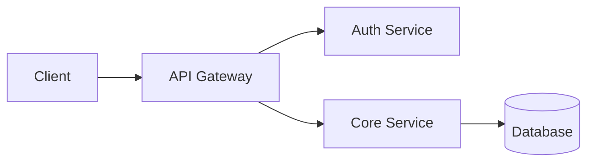

# README Section Guide

Use this reference in Create or Review mode when you need to decide which sections belong in a README, what order they should appear in, or how to format common Markdown elements cleanly.

## Always Required (All Types)

1. **Title + Description** — Project name + one-liner (what it does, for whom)
2. **Getting Started** — How to use, read, install, or navigate (varies by type). For community projects like awesome lists and org profiles, this may be a "How to navigate" or "How to contribute" section rather than an install guide — or may be omitted entirely if the README itself is the destination.
3. **Core content** — Usage example, content overview, data description, or curriculum (varies by type)

## Software Projects

| Section | OSS Lib | Web Svc | CLI | Personal | Internal | Monorepo | Config |
|---------|:-------:|:-------:|:---:|:--------:|:--------:|:--------:|:------:|
| Badges | Yes | Yes | Yes | Opt | No | Yes | No |
| Visual (screenshot/GIF) | Opt | Yes | Yes | Yes | Opt | Opt | No |
| Features | Yes | Yes | Yes | Opt | No | Opt | No |
| Quick Start / Usage | Yes | Yes | Yes | Yes | Yes | Per-pkg | Brief |
| API Reference | Yes | If public | No | No | If needed | Per-pkg | No |
| Config / Env Vars | If needed | Yes | Yes | No | Yes | Per-pkg | Yes |
| Architecture | Opt | Yes | Opt | Opt | Yes | Yes | No |
| What's Here (dir map) | No | No | No | No | No | Yes | Yes |
| Deployment | No | Yes | No | No | Yes | Opt | No |
| Testing | Yes | Yes | Opt | No | Yes | Yes | No |
| Contributing | Yes | Opt | Yes | No | Yes | Yes | No |
| Roadmap | Opt | Opt | Opt | Opt | No | Opt | No |
| FAQ | Opt | Opt | Opt | No | No | Opt | No |
| Troubleshooting | Opt | Yes | Yes | No | Yes | Opt | Yes |
| What I Learned | No | No | No | Yes | No | No | No |
| Gotchas | No | No | No | No | Yes | Opt | Yes |
| License | Yes | Yes | Yes | Opt | No | Yes | No |

## Content, Research & Community Projects

| Section | Docs/KB | Tutorial | Blog | Dataset | Academic | Community |
|---------|:-------:|:--------:|:----:|:-------:|:--------:|:---------:|
| Badges | Opt | Opt | Opt | Yes | Opt | Yes |
| Visual (screenshot/preview) | Opt | Yes | Opt | Opt | Yes | No |
| Table of Contents | Yes | Yes | Opt | Opt | Opt | Yes |
| Content Overview / What's Inside | Yes | Yes | Yes | Yes | Yes | Yes |
| How to Navigate / Read | Yes | Yes | Opt | No | Opt | Yes |
| Prerequisites (knowledge) | Opt | Yes | No | Yes | Yes | No |
| Getting Started / Setup | Yes | Opt | Opt | Yes | Yes | No |
| Data Description / Schema | No | No | No | Yes | Opt | No |
| Methodology / Approach | No | No | No | Opt | Yes | No |
| Curriculum / Learning Path | No | Yes | No | No | No | No |
| Citation / How to Cite | No | No | No | Yes | Yes | No |
| Results / Findings | No | No | No | Opt | Yes | No |
| How to Contribute | Yes | Opt | Yes | Opt | Opt | Yes |
| Contribution Guidelines | Opt | Opt | Yes | No | No | Yes |
| Related Resources | Opt | Yes | Opt | Yes | Yes | Opt |
| License / Data License | Yes | Opt | Opt | Yes | Yes | Opt |
| Acknowledgments | Opt | Opt | Opt | Yes | Yes | Opt |

**Opt** = include if the project has relevant content; omit otherwise.

## Section Writing Guide

**Title + Badges:**

```markdown
# Project Name

Brief one-liner: what it does and who it's for.

[](link)
[](link)
[](LICENSE)
```

Use 3-5 meaningful badges max. CI status, version, and license are the most useful. Avoid badge clutter.

**Visual Element:**

A screenshot, terminal recording, or demo GIF right after the description. For CLI tools, consider VHS or Asciinema terminal recordings. One good visual replaces paragraphs of description.

**Installation:**

````markdown
## Installation

```bash
npm install my-package
```

### Prerequisites
- Node.js >= 18
- PostgreSQL 15+
````

List prerequisites with specific versions. Never assume setup is obvious. Include multiple package managers if relevant (npm, yarn, pnpm).

**Usage:**

Show the simplest working example first, then add complexity. The reader should copy-paste and see results.

**Architecture (when included):**

Use Mermaid diagrams. They are versionable, searchable, and diff-friendly:

````markdown

````

**Environment Variables (when included):**

| Variable | Description | Required | Default |
|----------|-------------|:--------:|---------|
| `DATABASE_URL` | PostgreSQL connection string | Yes | — |
| `PORT` | Server port | No | `3000` |

**FAQ (when included):**

Use collapsible sections to keep the README scannable:

```markdown
<details>
<summary>How do I configure X?</summary>

Answer with code examples.

</details>
```

## GitHub Markdown Features

Use these where appropriate:

| Feature | Syntax | Best For |
|---------|--------|----------|
| **Mermaid diagrams** | ` ```mermaid ` code block | Architecture, data flow, sequences |
| **Admonitions** | `> [!NOTE]`, `> [!TIP]`, `> [!IMPORTANT]`, `> [!WARNING]`, `> [!CAUTION]` | Callouts, warnings, prerequisites |
| **Collapsible sections** | `<details><summary>Title</summary>` | Long examples, FAQ, verbose output |
| **Task lists** | `- [ ] item` | Roadmaps |
| **Footnotes** | `text[^1]` with `[^1]: detail` | Attribution, clarifications |
| **Dark/light images** | `img.png#gh-dark-mode-only` | Logos, diagrams |
